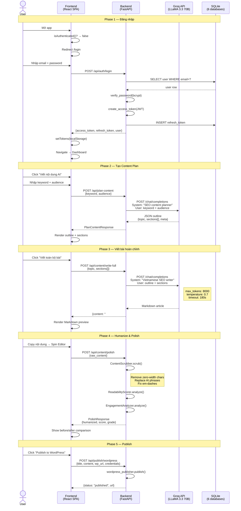
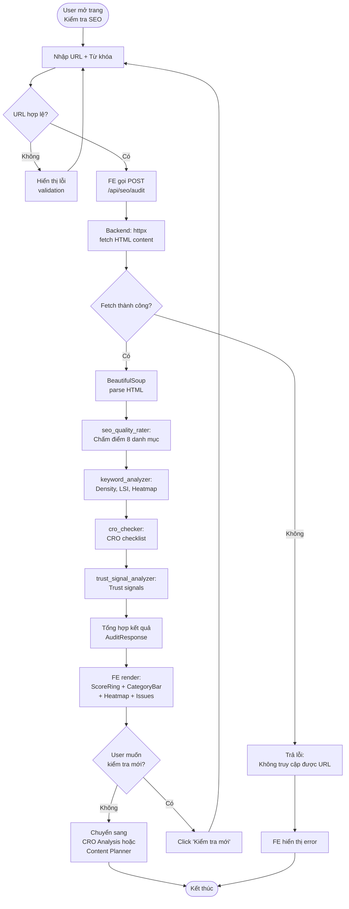
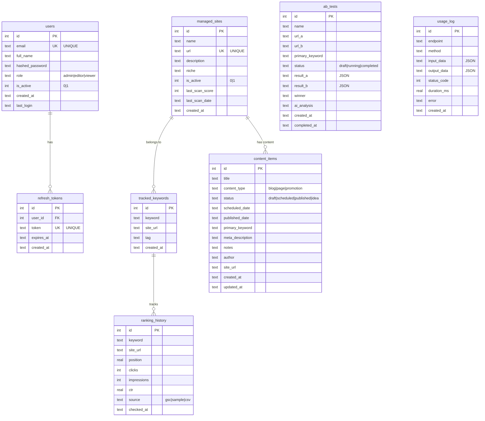
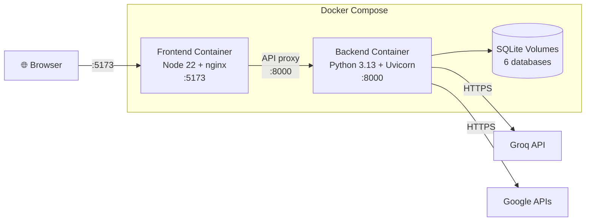
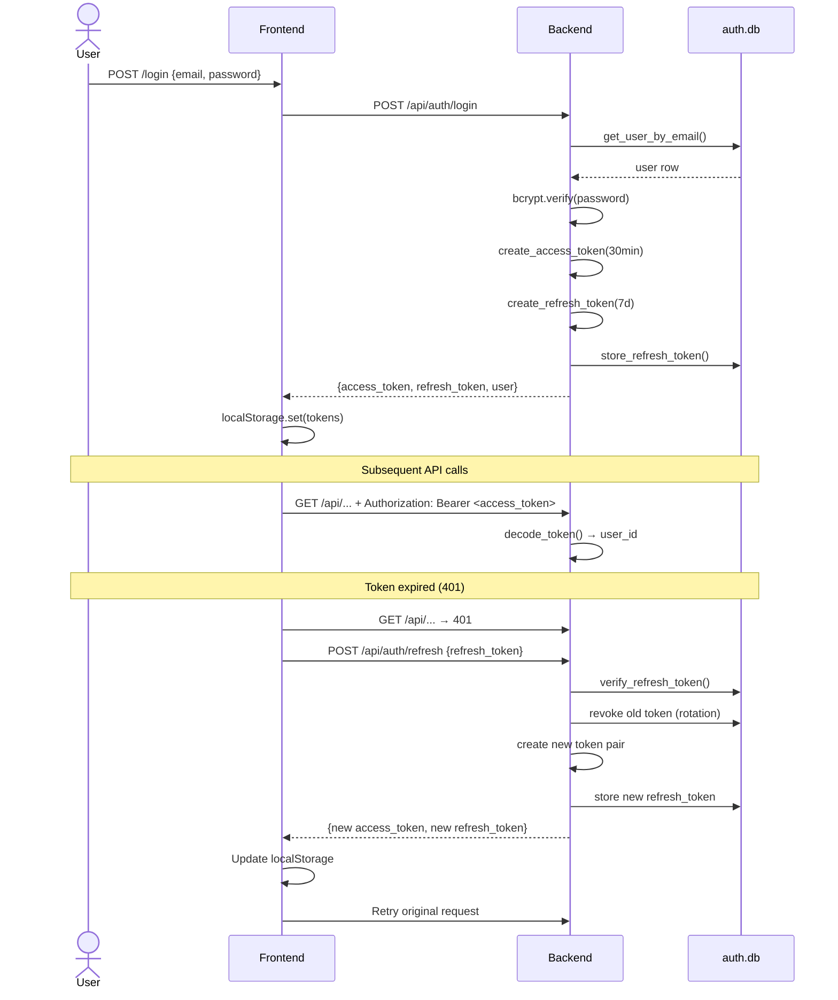

# AI Marketing Hub — Diagrams cho Báo cáo

> Copy trực tiếp Mermaid code vào slide hoặc dùng [mermaid.live](https://mermaid.live) để render.

---

## 1. Use Case Diagram

```mermaid
graph TB
    subgraph Actors
        U["👤 User<br/>(Editor/Viewer)"]
        A["👑 Admin"]
        AI["🤖 Groq LLaMA 3.3"]
        GSC["🔗 Google Search Console"]
        PSI["⚡ PageSpeed Insights"]
    end

    subgraph UC_SEO["Phân tích SEO"]
        UC1["SEO Audit<br/>(On-page)"]
        UC2["Technical SEO<br/>(8 tiêu chí)"]
        UC3["Core Web Vitals<br/>(LCP, INP, CLS)"]
        UC4["CRO & Trust<br/>Analysis"]
        UC5["SERP Live"]
        UC6["Backlink<br/>Analyzer"]
        UC7["Broken Link<br/>Checker"]
        UC8["Schema<br/>Validator"]
    end

    subgraph UC_KW["Từ khóa"]
        UC9["Rank Tracker"]
        UC10["AI Keyword<br/>Analysis"]
        UC11["Competitor Gap<br/>Analysis"]
    end

    subgraph UC_CONTENT["Nội dung AI"]
        UC12["AI Content<br/>Planner"]
        UC13["AI Article<br/>Writer"]
        UC14["Spin Editor"]
        UC15["Content<br/>Humanizer"]
    end

    subgraph UC_GEO["Tối ưu GEO"]
        UC16["GEO Optimizer<br/>(E-E-A-T)"]
        UC17["Schema.org<br/>Generator<br/>(12 types)"]
    end

    subgraph UC_TOOLS["Công cụ & Quản lý"]
        UC18["Content Calendar"]
        UC19["A/B Testing SEO"]
        UC20["Report Generator"]
        UC21["Campaign Tracker"]
        UC22["File Converter"]
        UC23["Multi-site Manager"]
    end

    subgraph UC_AUTH["Hệ thống"]
        UC24["Đăng ký /<br/>Đăng nhập"]
        UC25["Quản lý<br/>người dùng"]
        UC26["WordPress<br/>Publisher"]
    end

    U --> UC1 & UC2 & UC3 & UC4 & UC5 & UC6 & UC7 & UC8
    U --> UC9 & UC10 & UC11
    U --> UC12 & UC13 & UC14 & UC15
    U --> UC16 & UC17
    U --> UC18 & UC19 & UC20 & UC21 & UC22 & UC23
    U --> UC24 & UC26

    A --> UC25

    UC3 -.->|"API call"| PSI
    UC9 -.->|"Sync data"| GSC
    UC10 -.->|"AI analysis"| AI
    UC12 -.->|"Generate outline"| AI
    UC13 -.->|"Write article"| AI
    UC14 -.->|"Spin content"| AI
    UC16 -.->|"GEO analysis"| AI
    UC5 -.->|"Search data"| GSC
```

---

## 2. Sequence Diagram — Luồng AI Article Writer (luồng phức tạp nhất)

---

## 3. Activity Diagram — Luồng SEO Audit

---

## 4. ERD — Lược đồ quan hệ dữ liệu (6 SQLite databases)

---

## 5. Component Architecture Diagram

```mermaid
graph TB
    subgraph Frontend["Frontend (React 19 SPA)"]
        direction TB
        RT["react-router-dom<br/>22 routes"]
        APP["App.tsx<br/>(74KB, routing + layout)"]
        
        subgraph Components["37 Components"]
            C1["DashboardOverview"]
            C2["CoreWebVitals"]
            C3["BrokenLinkChecker"]
            C4["SchemaValidator"]
            C5["GeoOptimizer"]
            C6["RankTracker"]
            C7["SpinEditor"]
            C8["ContentPlanner"]
            C9["AuthPage"]
            C10["...28 more"]
        end

        subgraph Hooks["6 Custom Hooks"]
            H1["useSeoAudit"]
            H2["useSerpLive"]
            H3["useAutoFill"]
            H4["useOpportunities"]
            H5["usePolish"]
            H6["usePublish"]
        end

        subgraph Lib["Libraries"]
            L1["apiConfig.ts"]
            L2["auth.ts<br/>(authFetch, JWT)"]
            L3["history.ts"]
            L4["i18n.ts"]
        end

        subgraph SEO_Meta["SEO Infrastructure"]
            S1["SEOHead<br/>(react-helmet-async)"]
            S2["JsonLd<br/>(3 schema builders)"]
            S3["seoConfig<br/>(22 route metadata)"]
        end

        RT --> APP --> Components
        Components --> Hooks
        Hooks --> Lib
        APP --> SEO_Meta
    end

    subgraph Backend["Backend (FastAPI)"]
        direction TB
        MAIN["main.py<br/>(middleware + 15 routers)"]
        
        subgraph Routers["15 API Routers"]
            R1["api_seo.py"]
            R2["api_seo_tools.py"]
            R3["api_content.py"]
            R4["api_content_writer.py"]
            R5["api_new_features.py"]
            R6["api_user_auth.py"]
            R7["...9 more"]
        end

        subgraph Core["50 Core Modules"]
            M1["seo_quality_rater"]
            M2["keyword_analyzer"]
            M3["core_web_vitals"]
            M4["broken_link_checker"]
            M5["article_writer"]
            M6["content_scrubber"]
            M7["geo_analyzer"]
            M8["rank_tracker"]
            M9["auth / auth_db"]
            M10["...41 more"]
        end

        MAIN --> Routers --> Core
    end

    subgraph Data["Data Layer"]
        DB1[("auth.db")]
        DB2[("sites.db")]
        DB3[("rank_tracker.db")]
        DB4[("content_calendar.db")]
        DB5[("ab_tests.db")]
        DB6[("usage_history.db")]
    end

    subgraph External["External APIs"]
        E1["Groq API<br/>(LLaMA 3.3 70B)"]
        E2["Google PageSpeed<br/>Insights"]
        E3["Google Search<br/>Console"]
        E4["DataForSEO"]
    end

    Frontend -->|"fetch / authFetch<br/>localhost:8000/api"| Backend
    Core --> Data
    Core -->|"httpx async"| External
```

---

## 6. Deployment Architecture

---

## 7. Auth Flow — JWT Token Lifecycle

