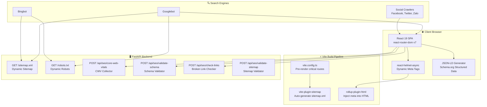
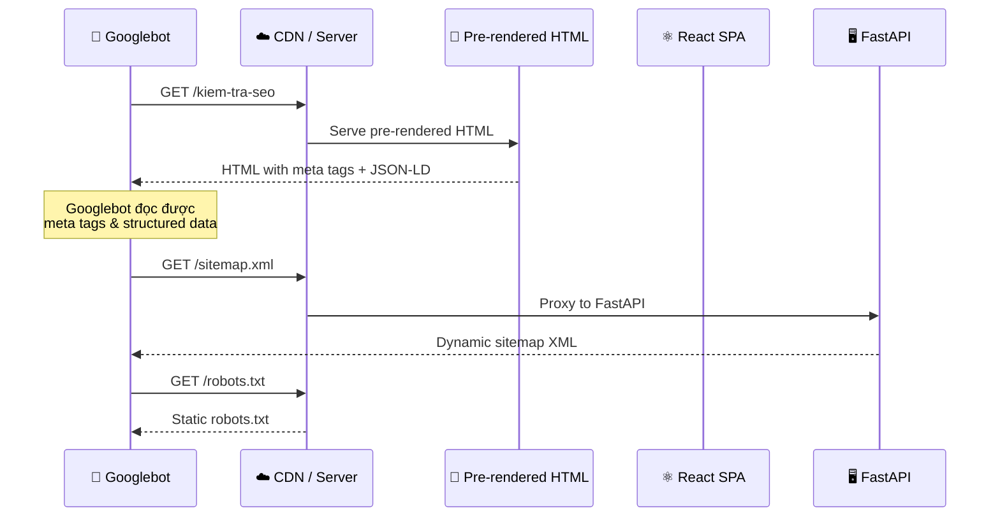
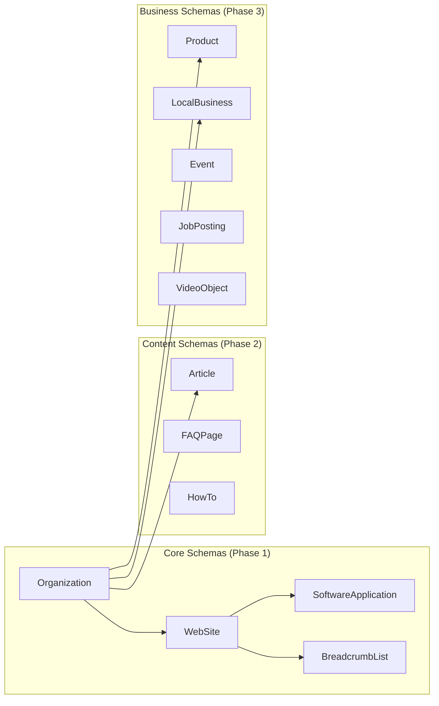
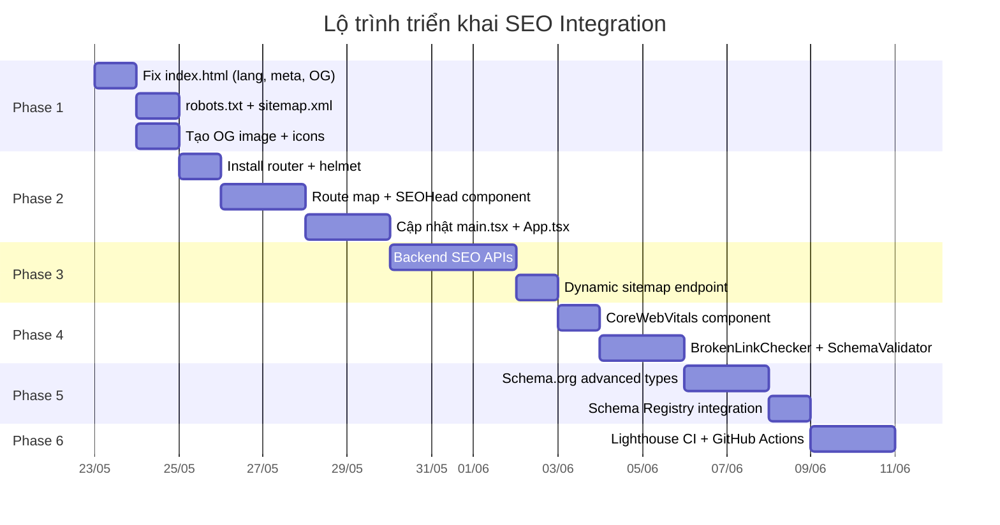

# 🔍 ĐẶC TẢ TÍCH HỢP SEO — AI Marketing Hub v3.2.0

> **Ngày tạo:** 22/05/2026  
> **Phiên bản:** 3.2.0 (Phase 20)  
> **Tác giả:** AI Marketing Hub Team  
> **Trạng thái:** 📋 Đề xuất — Chờ phê duyệt  
> **Kiến trúc:** FastAPI 0.x (Backend) + React 19 / Vite 8 / TypeScript 6 (Frontend)

---

## Mục lục

1. [Tổng quan](#1-tổng-quan)
2. [Phân tích hiện trạng](#2-phân-tích-hiện-trạng)
3. [Kiến trúc SEO đề xuất](#3-kiến-trúc-seo-đề-xuất)
4. [Phase 1: SEO Foundation](#4-phase-1-seo-foundation)
5. [Phase 2: Frontend SEO Infrastructure](#5-phase-2-frontend-seo-infrastructure)
6. [Phase 3: Backend SEO APIs](#6-phase-3-backend-seo-apis)
7. [Phase 4: UI Components](#7-phase-4-ui-components)
8. [Phase 5: Schema.org Advanced](#8-phase-5-schemaorg-advanced)
9. [Phase 6: CI/CD Pipeline](#9-phase-6-cicd-pipeline)
10. [Checklist SEO](#10-checklist-seo)
11. [Tài liệu tham khảo](#11-tài-liệu-tham-khảo)

---

## 1. Tổng quan

### 1.1 Mục đích

Tài liệu này là **đặc tả kỹ thuật chính thức** cho việc tích hợp SEO toàn diện vào dự án AI Marketing Hub. Hiện tại, dự án là một **SPA (Single Page Application)** thuần túy — toàn bộ ứng dụng chạy trên một URL duy nhất (`/`), không có routing, không có meta tags động, không có structured data, và không có bất kỳ cơ sở hạ tầng SEO nào.

### 1.2 Phạm vi

| Khía cạnh | Phạm vi |
|-----------|---------|
| **Frontend** | React 19 + Vite 8 + TypeScript 6, 19 tabs, vanilla CSS |
| **Backend** | FastAPI + Python 3.12, 12 routers, 45+ API endpoints |
| **Database** | 4 SQLite databases |
| **AI Provider** | Groq LLaMA 3.3 70B |
| **Target domain** | `ai-marketing-hub.vn` (ví dụ) |

### 1.3 Mục tiêu SEO

1. **Crawlability** — Cho phép Google/Bing crawl và index tất cả trang quan trọng
2. **Rich Snippets** — Hiển thị structured data trên SERP (FAQ, Software, Breadcrumb)
3. **Core Web Vitals** — LCP < 2.5s, FID < 100ms, CLS < 0.1
4. **Social Sharing** — Open Graph + Twitter Card cho sharing trên social media
5. **International SEO** — `lang="vi"` đúng, hreflang nếu cần mở rộng
6. **Technical SEO** — robots.txt, sitemap.xml, canonical URLs, 404 handling

---

## 2. Phân tích hiện trạng

### 2.1 Bảng đánh giá hiện trạng SEO

| Yếu tố SEO | Hiện trạng | Trạng thái | Mức độ ưu tiên |
|-------------|-----------|-------------|-----------------|
| `robots.txt` | Có file cơ bản tại `frontend/public/robots.txt`, trỏ sitemap URL chưa tồn tại | ⚠️ Chưa hoàn thiện | 🔴 Cao |
| `sitemap.xml` | **Không có** | ❌ Thiếu | 🔴 Cao |
| `<html lang="">` | `lang="en"` nhưng UI là tiếng Việt | ❌ Sai | 🔴 Cao |
| `<title>` | Hardcode: "AI Marketing Hub — SEO Audit" | ⚠️ Cứng, không động | 🔴 Cao |
| `<meta description>` | **Không có** | ❌ Thiếu | 🔴 Cao |
| `<meta keywords>` | **Không có** | ❌ Thiếu | 🟡 Trung bình |
| Open Graph tags | **Không có** | ❌ Thiếu | 🟡 Trung bình |
| Twitter Card tags | **Không có** | ❌ Thiếu | 🟡 Trung bình |
| JSON-LD / Schema.org | **Không có** | ❌ Thiếu | 🔴 Cao |
| Canonical URL | **Không có** | ❌ Thiếu | 🔴 Cao |
| URL Routing | Không có — SPA chạy trên `/` duy nhất | ❌ Thiếu | 🔴 Cao |
| SSR / Pre-rendering | **Không có** — client-side only | ❌ Thiếu | 🟡 Trung bình |
| `favicon.svg` | ✅ Có | ✅ Đạt | — |
| `translate="no"` | ✅ Có | ✅ Đạt | — |
| Viewport meta | ✅ Có | ✅ Đạt | — |
| Charset UTF-8 | ✅ Có | ✅ Đạt | — |
| CORS Headers | ✅ Có (allow all) | ⚠️ Cần siết chặt | 🟡 Trung bình |
| 404 Page | **Không có** | ❌ Thiếu | 🟡 Trung bình |
| Breadcrumbs | **Không có** | ❌ Thiếu | 🟡 Trung bình |
| Alt text cho ảnh | Chỉ có SVG icons — không có alt text | ⚠️ Chưa đủ | 🟡 Trung bình |
| Heading hierarchy | Dùng `<h1>` cho topbar title, OK | ⚠️ Cần kiểm tra | 🟡 Trung bình |
| Performance (LCP) | Chưa đo lường | ❓ Chưa biết | 🟡 Trung bình |

### 2.2 Phân tích file `index.html` hiện tại

```html
<!-- frontend/index.html — HIỆN TẠI -->
<!doctype html>
<html lang="en" class="notranslate" translate="no">
  <head>
    <meta charset="UTF-8" />
    <meta name="google" content="notranslate" />
    <link rel="icon" type="image/svg+xml" href="/favicon.svg" />
    <meta name="viewport" content="width=device-width, initial-scale=1.0" />
    <title>AI Marketing Hub — SEO Audit</title>
  </head>
  <body>
    <div id="root"></div>
    <script type="module" src="/src/main.tsx"></script>
  </body>
</html>
```

**Vấn đề chính:**
1. `lang="en"` → phải là `lang="vi"` (UI tiếng Việt)
2. Không có `<meta name="description">`
3. Không có Open Graph / Twitter Card tags
4. Không có JSON-LD structured data
5. Không có `<link rel="canonical">`
6. Title cứng, không phản ánh đầy đủ chức năng

### 2.3 Phân tích `main.tsx` hiện tại

```tsx
// frontend/src/main.tsx — HIỆN TẠI
import { StrictMode } from 'react'
import { createRoot } from 'react-dom/client'
import './index.css'
import App from './App.tsx'

createRoot(document.getElementById('root')!).render(
  <StrictMode>
    <App />
  </StrictMode>,
)
```

**Vấn đề:** Không có Router, không có HelmetProvider — mỗi tab của ứng dụng đều sống trên cùng URL `/`.

---

## 3. Kiến trúc SEO đề xuất

### 3.1 Sơ đồ kiến trúc tổng quan



### 3.2 Chiến lược SEO cho SPA

Dự án hiện tại là **SPA thuần** với tab-based navigation. Có 3 phương án tiếp cận:

| Phương án | Mô tả | Ưu điểm | Nhược điểm | Đề xuất |
|-----------|--------|---------|------------|---------|
| **A. Client-side Routing + Pre-render** | Thêm `react-router-dom`, pre-render các trang static | Đơn giản triển khai, tương thích codebase hiện tại | Cần plugin pre-render | ✅ **Chọn** |
| **B. Full SSR (Next.js migration)** | Migrate sang Next.js / Remix | SEO tối ưu nhất | Viết lại toàn bộ frontend, rủi ro cao | ❌ |
| **C. Hybrid (Astro + React Islands)** | Dùng Astro cho shell, React cho interactive | SEO tốt, bundle nhỏ | Thay đổi kiến trúc lớn | ❌ |

**Quyết định:** Áp dụng **Phương án A** — thêm `react-router-dom` cho URL routing, `react-helmet-async` cho dynamic meta tags, và `vite-plugin-ssr` hoặc `prerender-spa-plugin` cho pre-rendering các trang quan trọng tại build time.

### 3.3 Luồng xử lý SEO



---

## 4. Phase 1: SEO Foundation

> **Mục tiêu:** Fix các vấn đề SEO cơ bản nhất — `index.html`, `robots.txt`, `sitemap.xml`  
> **Thời gian ước tính:** 1-2 ngày  
> **Độ phức tạp:** Thấp

### 4.1 Fix `index.html`

Cập nhật `frontend/index.html` với đầy đủ meta tags:

```html
<!-- frontend/index.html — SAU KHI CẬP NHẬT -->
<!doctype html>
<html lang="vi" class="notranslate" translate="no">
  <head>
    <meta charset="UTF-8" />
    <meta name="viewport" content="width=device-width, initial-scale=1.0" />
    <meta name="google" content="notranslate" />

    <!-- ── SEO Foundation ────────────────────────────────── -->
    <title>AI Marketing Hub — Công cụ SEO & Marketing AI toàn diện</title>
    <meta name="description" content="AI Marketing Hub — Nền tảng SEO Audit, CRO Analysis, Content AI, Rank Tracker, Technical SEO và 15+ công cụ marketing tích hợp AI. Phân tích SEO chuyên sâu cho website Việt Nam." />
    <meta name="keywords" content="SEO audit, kiểm tra SEO, phân tích SEO, AI marketing, content AI, rank tracker, technical SEO, CRO, backlink analyzer, keyword research" />
    <meta name="author" content="AI Marketing Hub" />
    <meta name="robots" content="index, follow" />
    <link rel="canonical" href="https://ai-marketing-hub.vn/" />

    <!-- ── Open Graph (Facebook, Zalo, LinkedIn) ─────────── -->
    <meta property="og:type" content="website" />
    <meta property="og:site_name" content="AI Marketing Hub" />
    <meta property="og:title" content="AI Marketing Hub — Công cụ SEO & Marketing AI toàn diện" />
    <meta property="og:description" content="Nền tảng SEO Audit, CRO Analysis, Content AI, Rank Tracker và 15+ công cụ marketing tích hợp AI cho website Việt Nam." />
    <meta property="og:url" content="https://ai-marketing-hub.vn/" />
    <meta property="og:image" content="https://ai-marketing-hub.vn/og-image.png" />
    <meta property="og:image:width" content="1200" />
    <meta property="og:image:height" content="630" />
    <meta property="og:locale" content="vi_VN" />

    <!-- ── Twitter Card ──────────────────────────────────── -->
    <meta name="twitter:card" content="summary_large_image" />
    <meta name="twitter:title" content="AI Marketing Hub — Công cụ SEO & Marketing AI" />
    <meta name="twitter:description" content="15+ công cụ SEO & Marketing AI tích hợp. Phân tích SEO, CRO, Content AI cho website Việt Nam." />
    <meta name="twitter:image" content="https://ai-marketing-hub.vn/og-image.png" />

    <!-- ── Favicon & Icons ───────────────────────────────── -->
    <link rel="icon" type="image/svg+xml" href="/favicon.svg" />
    <link rel="apple-touch-icon" sizes="180x180" href="/apple-touch-icon.png" />
    <meta name="theme-color" content="#0f172a" />

    <!-- ── JSON-LD Structured Data (Static fallback) ─────── -->
    <script type="application/ld+json">
    {
      "@context": "https://schema.org",
      "@graph": [
        {
          "@type": "WebSite",
          "name": "AI Marketing Hub",
          "url": "https://ai-marketing-hub.vn/",
          "description": "Nền tảng công cụ SEO & Marketing AI toàn diện cho website Việt Nam",
          "inLanguage": "vi",
          "potentialAction": {
            "@type": "SearchAction",
            "target": "https://ai-marketing-hub.vn/tim-kiem?q={search_term_string}",
            "query-input": "required name=search_term_string"
          }
        },
        {
          "@type": "SoftwareApplication",
          "name": "AI Marketing Hub",
          "applicationCategory": "BusinessApplication",
          "operatingSystem": "Web",
          "description": "Công cụ SEO Audit, CRO Analysis, Content AI, Rank Tracker tích hợp AI",
          "offers": {
            "@type": "Offer",
            "price": "0",
            "priceCurrency": "VND"
          },
          "aggregateRating": {
            "@type": "AggregateRating",
            "ratingValue": "4.8",
            "ratingCount": "150"
          }
        },
        {
          "@type": "Organization",
          "name": "AI Marketing Hub",
          "url": "https://ai-marketing-hub.vn/",
          "logo": "https://ai-marketing-hub.vn/favicon.svg",
          "sameAs": []
        }
      ]
    }
    </script>
  </head>
  <body>
    <div id="root"></div>
    <script type="module" src="/src/main.tsx"></script>
  </body>
</html>
```

### 4.2 Cập nhật `robots.txt`

```text
# frontend/public/robots.txt — CẬP NHẬT

# ── Cho phép tất cả Search Engines ─────────────────────
User-agent: *
Allow: /
Disallow: /api/
Disallow: /assets/
Disallow: /src/

# ── Chặn AI Training Bots (tùy chọn) ──────────────────
User-agent: GPTBot
Disallow: /

User-agent: ChatGPT-User
Disallow: /

User-agent: CCBot
Disallow: /

User-agent: Google-Extended
Disallow: /

# ── Sitemap ────────────────────────────────────────────
Sitemap: https://ai-marketing-hub.vn/sitemap.xml

# ── Crawl-delay (lịch sự với server) ──────────────────
User-agent: *
Crawl-delay: 1
```

### 4.3 Tạo `sitemap.xml`

#### 4.3.1 Static sitemap (tạo tại build time)

Tạo file `frontend/public/sitemap.xml`:

```xml
<?xml version="1.0" encoding="UTF-8"?>
<urlset xmlns="http://www.sitemaps.org/schemas/sitemap/0.9"
        xmlns:xhtml="http://www.w3.org/1999/xhtml">

  <!-- Trang chủ / Dashboard -->
  <url>
    <loc>https://ai-marketing-hub.vn/</loc>
    <lastmod>2026-05-22</lastmod>
    <changefreq>daily</changefreq>
    <priority>1.0</priority>
  </url>

  <!-- Kiểm tra SEO -->
  <url>
    <loc>https://ai-marketing-hub.vn/kiem-tra-seo</loc>
    <lastmod>2026-05-22</lastmod>
    <changefreq>weekly</changefreq>
    <priority>0.9</priority>
  </url>

  <!-- Technical SEO -->
  <url>
    <loc>https://ai-marketing-hub.vn/technical-seo</loc>
    <lastmod>2026-05-22</lastmod>
    <changefreq>weekly</changefreq>
    <priority>0.8</priority>
  </url>

  <!-- CRO & Uy tín -->
  <url>
    <loc>https://ai-marketing-hub.vn/cro-uy-tin</loc>
    <lastmod>2026-05-22</lastmod>
    <changefreq>weekly</changefreq>
    <priority>0.8</priority>
  </url>

  <!-- SERP trực tiếp -->
  <url>
    <loc>https://ai-marketing-hub.vn/serp-truc-tiep</loc>
    <lastmod>2026-05-22</lastmod>
    <changefreq>weekly</changefreq>
    <priority>0.7</priority>
  </url>

  <!-- Backlinks -->
  <url>
    <loc>https://ai-marketing-hub.vn/backlinks</loc>
    <lastmod>2026-05-22</lastmod>
    <changefreq>weekly</changefreq>
    <priority>0.7</priority>
  </url>

  <!-- Theo dõi Keyword -->
  <url>
    <loc>https://ai-marketing-hub.vn/theo-doi-keyword</loc>
    <lastmod>2026-05-22</lastmod>
    <changefreq>daily</changefreq>
    <priority>0.8</priority>
  </url>

  <!-- AI Keyword Analysis -->
  <url>
    <loc>https://ai-marketing-hub.vn/ai-keyword</loc>
    <lastmod>2026-05-22</lastmod>
    <changefreq>weekly</changefreq>
    <priority>0.7</priority>
  </url>

  <!-- Phân tích đối thủ -->
  <url>
    <loc>https://ai-marketing-hub.vn/phan-tich-doi-thu</loc>
    <lastmod>2026-05-22</lastmod>
    <changefreq>weekly</changefreq>
    <priority>0.8</priority>
  </url>

  <!-- Viết nội dung AI -->
  <url>
    <loc>https://ai-marketing-hub.vn/viet-noi-dung-ai</loc>
    <lastmod>2026-05-22</lastmod>
    <changefreq>weekly</changefreq>
    <priority>0.9</priority>
  </url>

  <!-- Spin Editor -->
  <url>
    <loc>https://ai-marketing-hub.vn/spin-editor</loc>
    <lastmod>2026-05-22</lastmod>
    <changefreq>weekly</changefreq>
    <priority>0.6</priority>
  </url>

  <!-- Tối ưu GEO -->
  <url>
    <loc>https://ai-marketing-hub.vn/toi-uu-geo</loc>
    <lastmod>2026-05-22</lastmod>
    <changefreq>weekly</changefreq>
    <priority>0.7</priority>
  </url>

  <!-- Lịch nội dung -->
  <url>
    <loc>https://ai-marketing-hub.vn/lich-noi-dung</loc>
    <lastmod>2026-05-22</lastmod>
    <changefreq>daily</changefreq>
    <priority>0.6</priority>
  </url>

  <!-- A/B Testing -->
  <url>
    <loc>https://ai-marketing-hub.vn/ab-testing</loc>
    <lastmod>2026-05-22</lastmod>
    <changefreq>weekly</changefreq>
    <priority>0.6</priority>
  </url>

  <!-- Báo cáo AI -->
  <url>
    <loc>https://ai-marketing-hub.vn/bao-cao-ai</loc>
    <lastmod>2026-05-22</lastmod>
    <changefreq>weekly</changefreq>
    <priority>0.6</priority>
  </url>

  <!-- Chiến dịch -->
  <url>
    <loc>https://ai-marketing-hub.vn/chien-dich</loc>
    <lastmod>2026-05-22</lastmod>
    <changefreq>weekly</changefreq>
    <priority>0.6</priority>
  </url>

  <!-- File Converter -->
  <url>
    <loc>https://ai-marketing-hub.vn/file-converter</loc>
    <lastmod>2026-05-22</lastmod>
    <changefreq>monthly</changefreq>
    <priority>0.5</priority>
  </url>

  <!-- Multi-site Manager -->
  <url>
    <loc>https://ai-marketing-hub.vn/quan-ly-site</loc>
    <lastmod>2026-05-22</lastmod>
    <changefreq>monthly</changefreq>
    <priority>0.4</priority>
  </url>

  <!-- Cấu hình Google -->
  <url>
    <loc>https://ai-marketing-hub.vn/cau-hinh-google</loc>
    <lastmod>2026-05-22</lastmod>
    <changefreq>monthly</changefreq>
    <priority>0.3</priority>
  </url>

</urlset>
```

#### 4.3.2 Dynamic Sitemap API (Backend)

Thêm endpoint vào `backend/main.py` hoặc tạo `backend/routers/api_sitemap.py`:

```python
# backend/routers/api_sitemap.py
"""Dynamic Sitemap Generator — tạo sitemap.xml dựa trên routes hiện tại."""

from datetime import date
from fastapi import APIRouter
from fastapi.responses import Response

router = APIRouter(tags=["sitemap"])

ROUTES = [
    {"loc": "/", "priority": "1.0", "changefreq": "daily"},
    {"loc": "/kiem-tra-seo", "priority": "0.9", "changefreq": "weekly"},
    {"loc": "/technical-seo", "priority": "0.8", "changefreq": "weekly"},
    {"loc": "/cro-uy-tin", "priority": "0.8", "changefreq": "weekly"},
    {"loc": "/serp-truc-tiep", "priority": "0.7", "changefreq": "weekly"},
    {"loc": "/backlinks", "priority": "0.7", "changefreq": "weekly"},
    {"loc": "/theo-doi-keyword", "priority": "0.8", "changefreq": "daily"},
    {"loc": "/ai-keyword", "priority": "0.7", "changefreq": "weekly"},
    {"loc": "/phan-tich-doi-thu", "priority": "0.8", "changefreq": "weekly"},
    {"loc": "/viet-noi-dung-ai", "priority": "0.9", "changefreq": "weekly"},
    {"loc": "/spin-editor", "priority": "0.6", "changefreq": "weekly"},
    {"loc": "/toi-uu-geo", "priority": "0.7", "changefreq": "weekly"},
    {"loc": "/lich-noi-dung", "priority": "0.6", "changefreq": "daily"},
    {"loc": "/ab-testing", "priority": "0.6", "changefreq": "weekly"},
    {"loc": "/bao-cao-ai", "priority": "0.6", "changefreq": "weekly"},
    {"loc": "/chien-dich", "priority": "0.6", "changefreq": "weekly"},
    {"loc": "/file-converter", "priority": "0.5", "changefreq": "monthly"},
    {"loc": "/quan-ly-site", "priority": "0.4", "changefreq": "monthly"},
    {"loc": "/cau-hinh-google", "priority": "0.3", "changefreq": "monthly"},
]

BASE_URL = "https://ai-marketing-hub.vn"


@router.get("/sitemap.xml")
async def sitemap_xml():
    """Trả về sitemap.xml động dựa trên danh sách routes."""
    today = date.today().isoformat()
    urls = []
    for route in ROUTES:
        urls.append(
            f"""  <url>
    <loc>{BASE_URL}{route['loc']}</loc>
    <lastmod>{today}</lastmod>
    <changefreq>{route['changefreq']}</changefreq>
    <priority>{route['priority']}</priority>
  </url>"""
        )

    xml = f"""<?xml version="1.0" encoding="UTF-8"?>
<urlset xmlns="http://www.sitemaps.org/schemas/sitemap/0.9">
{chr(10).join(urls)}
</urlset>"""

    return Response(content=xml, media_type="application/xml")
```

### 4.4 Tạo OG Image

Cần tạo file `frontend/public/og-image.png` với kích thước **1200×630px**, nội dung:

- Logo AI Marketing Hub
- Tagline: "Công cụ SEO & Marketing AI toàn diện"
- Background gradient tối (matching app theme)
- Kích thước file: < 300KB (tối ưu loading)

### 4.5 Tạo `apple-touch-icon.png`

Kích thước 180×180px, sử dụng logo của ứng dụng, đặt tại `frontend/public/apple-touch-icon.png`.

---

## 5. Phase 2: Frontend SEO Infrastructure

> **Mục tiêu:** Thêm URL routing cho từng tab, dynamic meta tags, JSON-LD per-page  
> **Thời gian ước tính:** 3-5 ngày  
> **Độ phức tạp:** Trung bình — Cao  
> **Dependencies:** `react-router-dom@7`, `react-helmet-async@2`

### 5.1 Cài đặt Dependencies

```bash
cd frontend
npm install react-router-dom@^7 react-helmet-async@^2
npm install -D @types/react-helmet-async  # nếu cần
```

### 5.2 Bản đồ Route — Tab → URL

Mapping tất cả 19 tabs sang URL có ý nghĩa SEO:

| # | TabId | URL Path | Title (Vietnamese) | Description |
|---|-------|----------|---------------------|-------------|
| 1 | `dashboard` | `/` | Dashboard — AI Marketing Hub | Tổng quan dữ liệu SEO, GSC, GA4 |
| 2 | `seo` | `/kiem-tra-seo` | Kiểm tra SEO — AI Marketing Hub | Phân tích SEO toàn diện từ URL |
| 3 | `techseo` | `/technical-seo` | Technical SEO — AI Marketing Hub | Quét 8 tiêu chí kỹ thuật SEO |
| 4 | `cro` | `/cro-uy-tin` | CRO & Uy tín — AI Marketing Hub | Đánh giá CRO, CTA, Trust Signals |
| 5 | `serp` | `/serp-truc-tiep` | SERP trực tiếp — AI Marketing Hub | Kết quả tìm kiếm Google thực |
| 6 | `backlinks` | `/backlinks` | Backlink Analyzer — AI Marketing Hub | Phân tích liên kết nội bộ/ngoài |
| 7 | `ranktracker` | `/theo-doi-keyword` | Theo dõi Keyword — AI Marketing Hub | Theo dõi vị trí từ khóa |
| 8 | `aikeys` | `/ai-keyword` | AI Keyword Analysis — AI Marketing Hub | Phân tích từ khóa bằng AI |
| 9 | `competitor` | `/phan-tich-doi-thu` | Phân tích đối thủ — AI Marketing Hub | So sánh nội dung với đối thủ |
| 10 | `planner` | `/viet-noi-dung-ai` | Viết nội dung AI — AI Marketing Hub | Tạo bài viết bằng AI |
| 11 | `spineditor` | `/spin-editor` | Spin Editor — AI Marketing Hub | Viết lại nội dung nhiều phiên bản |
| 12 | `geo` | `/toi-uu-geo` | Tối ưu GEO — AI Marketing Hub | Tối ưu cho AI Search Engines |
| 13 | `calendar` | `/lich-noi-dung` | Lịch nội dung — AI Marketing Hub | Lập lịch xuất bản nội dung |
| 14 | `abtest` | `/ab-testing` | A/B Testing — AI Marketing Hub | So sánh 2 phiên bản SEO |
| 15 | `report` | `/bao-cao-ai` | Báo cáo AI — AI Marketing Hub | Tổng hợp báo cáo SEO |
| 16 | `tracker` | `/chien-dich` | Chiến dịch — AI Marketing Hub | Theo dõi chiến dịch SEO |
| 17 | `fileconvert` | `/file-converter` | File Converter — AI Marketing Hub | Chuyển đổi file sang Markdown |
| 18 | `sites` | `/quan-ly-site` | Quản lý Multi-site — AI Marketing Hub | Quản lý nhiều website |
| 19 | `googlesetup` | `/cau-hinh-google` | Cấu hình Google — AI Marketing Hub | Cấu hình GSC, GA4 |

### 5.3 Route Configuration Map

```typescript
// frontend/src/config/routes.ts

export interface RouteConfig {
  tabId: string;
  path: string;
  title: string;
  description: string;
  keywords: string;
  ogImage?: string;
  jsonLdType?: string;
  priority: number;
}

export const ROUTE_MAP: RouteConfig[] = [
  {
    tabId: "dashboard",
    path: "/",
    title: "Dashboard — AI Marketing Hub",
    description:
      "Tổng quan dữ liệu SEO từ Google Search Console, GA4. Xem keywords, clicks, impressions, sessions theo thời gian thực.",
    keywords: "SEO dashboard, Google Search Console, GA4, analytics, thống kê SEO",
    priority: 1.0,
  },
  {
    tabId: "seo",
    path: "/kiem-tra-seo",
    title: "Kiểm tra SEO — AI Marketing Hub",
    description:
      "Phân tích SEO toàn diện từ URL — keyword density, chất lượng nội dung, on-page SEO. Chấm điểm 0-100 với grade A-F.",
    keywords: "kiểm tra SEO, SEO audit, phân tích SEO, keyword density, on-page SEO",
    jsonLdType: "SoftwareApplication",
    priority: 0.9,
  },
  {
    tabId: "techseo",
    path: "/technical-seo",
    title: "Technical SEO Scanner — AI Marketing Hub",
    description:
      "Quét 8 tiêu chí kỹ thuật SEO: meta tags, headings, images, mobile, links, sitemap, performance, security.",
    keywords: "technical SEO, meta tags, headings, mobile SEO, site speed",
    jsonLdType: "SoftwareApplication",
    priority: 0.8,
  },
  {
    tabId: "cro",
    path: "/cro-uy-tin",
    title: "CRO & Uy tín — AI Marketing Hub",
    description:
      "Đánh giá khả năng chuyển đổi: CRO checklist, CTA analysis, trust signals, above-the-fold. Weighted CRO score.",
    keywords: "CRO, conversion rate optimization, CTA, trust signals, uy tín website",
    priority: 0.8,
  },
  {
    tabId: "serp",
    path: "/serp-truc-tiep",
    title: "SERP trực tiếp — AI Marketing Hub",
    description:
      "Xem kết quả tìm kiếm Google thực cho bất kỳ từ khóa nào. Hỗ trợ 7+ quốc gia, phân tích đối thủ trên SERP.",
    keywords: "SERP, kết quả tìm kiếm Google, Google ranking, phân tích SERP",
    priority: 0.7,
  },
  {
    tabId: "backlinks",
    path: "/backlinks",
    title: "Backlink Analyzer — AI Marketing Hub",
    description:
      "Phân tích liên kết nội bộ và ngoài, đánh giá chất lượng anchor text, domain analysis.",
    keywords: "backlink analyzer, liên kết ngoài, anchor text, domain analysis",
    priority: 0.7,
  },
  {
    tabId: "ranktracker",
    path: "/theo-doi-keyword",
    title: "Theo dõi Keyword — AI Marketing Hub",
    description:
      "Theo dõi vị trí từ khóa theo thời gian, import/export CSV, cảnh báo tụt hạng. Sync từ Google Search Console.",
    keywords: "rank tracker, theo dõi keyword, vị trí từ khóa, ranking keyword",
    priority: 0.8,
  },
  {
    tabId: "aikeys",
    path: "/ai-keyword",
    title: "AI Keyword Analysis — AI Marketing Hub",
    description:
      "Phân tích từ khóa bằng AI — clustering, search volume, difficulty, content strategy. Powered by LLaMA 3.3 70B.",
    keywords: "AI keyword, phân tích từ khóa AI, keyword clustering, search volume",
    priority: 0.7,
  },
  {
    tabId: "competitor",
    path: "/phan-tich-doi-thu",
    title: "Phân tích đối thủ — AI Marketing Hub",
    description:
      "So sánh nội dung với đối thủ, tìm gap và cơ hội. Phân tích word count, content depth, structure.",
    keywords: "phân tích đối thủ, competitor analysis, content gap, so sánh SEO",
    priority: 0.8,
  },
  {
    tabId: "planner",
    path: "/viet-noi-dung-ai",
    title: "Viết nội dung AI — AI Marketing Hub",
    description:
      "Tạo kế hoạch bài viết chi tiết bằng AI: outline, meta tags, section plans, engagement map. Xuất bản lên WordPress.",
    keywords: "viết bài AI, content AI, AI writer, tạo nội dung, article planner",
    priority: 0.9,
  },
  {
    tabId: "spineditor",
    path: "/spin-editor",
    title: "Spin Editor — AI Marketing Hub",
    description:
      "Viết lại nội dung với nhiều phiên bản, nhiều giọng văn. 3 modes: Single, Multi-version, Paragraph spin.",
    keywords: "spin editor, viết lại nội dung, paraphrase, rewrite content",
    priority: 0.6,
  },
  {
    tabId: "geo",
    path: "/toi-uu-geo",
    title: "Tối ưu GEO — AI Marketing Hub",
    description:
      "Tối ưu cho AI Search Engines (SGE, Bing Chat, Perplexity). GEO score, FAQ Schema, LocalBusiness Schema.",
    keywords: "GEO, generative engine optimization, AI SEO, SGE, schema markup",
    priority: 0.7,
  },
  {
    tabId: "calendar",
    path: "/lich-noi-dung",
    title: "Lịch nội dung — AI Marketing Hub",
    description:
      "Lập lịch xuất bản nội dung, theo dõi trạng thái, AI đề xuất chủ đề. Quản lý từ nháp → đăng.",
    keywords: "lịch nội dung, content calendar, lập kế hoạch nội dung, editorial calendar",
    priority: 0.6,
  },
  {
    tabId: "abtest",
    path: "/ab-testing",
    title: "A/B Testing SEO — AI Marketing Hub",
    description:
      "So sánh 2 phiên bản title, description, content — AI đánh giá winner theo SEO, CTR, Intent Match.",
    keywords: "A/B testing SEO, so sánh title, so sánh description, SEO testing",
    priority: 0.6,
  },
  {
    tabId: "report",
    path: "/bao-cao-ai",
    title: "Báo cáo AI — AI Marketing Hub",
    description:
      "Tổng hợp tất cả kết quả scan + AI summary → export file báo cáo SEO toàn diện.",
    keywords: "báo cáo SEO, SEO report, AI report, tổng hợp phân tích",
    priority: 0.6,
  },
  {
    tabId: "tracker",
    path: "/chien-dich",
    title: "Chiến dịch SEO — AI Marketing Hub",
    description:
      "Theo dõi chiến dịch SEO: opportunity scoring, search intent, traffic projection, action items.",
    keywords: "chiến dịch SEO, campaign tracker, opportunity scoring, traffic projection",
    priority: 0.6,
  },
  {
    tabId: "fileconvert",
    path: "/file-converter",
    title: "File Converter — AI Marketing Hub",
    description:
      "Chuyển đổi PDF, Word, Excel, PowerPoint, HTML, ảnh sang Markdown. Drag-drop upload, 20+ định dạng.",
    keywords: "file converter, PDF to Markdown, Word to Markdown, chuyển đổi file",
    priority: 0.5,
  },
  {
    tabId: "sites",
    path: "/quan-ly-site",
    title: "Quản lý Multi-site — AI Marketing Hub",
    description:
      "Quản lý nhiều website, chuyển đổi context giữa các site. Thêm/xóa website, thiết lập active site.",
    keywords: "multi-site, quản lý website, site manager",
    priority: 0.4,
  },
  {
    tabId: "googlesetup",
    path: "/cau-hinh-google",
    title: "Cấu hình Google — AI Marketing Hub",
    description:
      "Cấu hình Google Search Console, GA4 API keys. Thiết lập kết nối dữ liệu thực.",
    keywords: "cấu hình Google, GSC setup, GA4 setup, API keys",
    priority: 0.3,
  },
];

/**
 * Helper: tìm route config từ tabId
 */
export function getRouteByTabId(tabId: string): RouteConfig | undefined {
  return ROUTE_MAP.find((r) => r.tabId === tabId);
}

/**
 * Helper: tìm route config từ path
 */
export function getRouteByPath(path: string): RouteConfig | undefined {
  return ROUTE_MAP.find((r) => r.path === path);
}

/**
 * Helper: tìm tabId từ path
 */
export function getTabIdByPath(path: string): string {
  return ROUTE_MAP.find((r) => r.path === path)?.tabId ?? "dashboard";
}
```

### 5.4 Component `SEOHead` — Dynamic Meta Tags

```tsx
// frontend/src/components/SEOHead.tsx

import { Helmet } from "react-helmet-async";

interface SEOHeadProps {
  title: string;
  description: string;
  keywords?: string;
  canonicalPath?: string;
  ogImage?: string;
  ogType?: string;
  jsonLd?: Record<string, unknown> | Record<string, unknown>[];
  noindex?: boolean;
}

const BASE_URL = "https://ai-marketing-hub.vn";
const DEFAULT_OG_IMAGE = `${BASE_URL}/og-image.png`;

export function SEOHead({
  title,
  description,
  keywords,
  canonicalPath = "/",
  ogImage = DEFAULT_OG_IMAGE,
  ogType = "website",
  jsonLd,
  noindex = false,
}: SEOHeadProps) {
  const canonicalUrl = `${BASE_URL}${canonicalPath}`;

  return (
    <Helmet>
      {/* ── Primary Meta Tags ──────────────────────────── */}
      <title>{title}</title>
      <meta name="description" content={description} />
      {keywords && <meta name="keywords" content={keywords} />}
      <meta
        name="robots"
        content={noindex ? "noindex, nofollow" : "index, follow"}
      />
      <link rel="canonical" href={canonicalUrl} />

      {/* ── Open Graph ─────────────────────────────────── */}
      <meta property="og:type" content={ogType} />
      <meta property="og:title" content={title} />
      <meta property="og:description" content={description} />
      <meta property="og:url" content={canonicalUrl} />
      <meta property="og:image" content={ogImage} />
      <meta property="og:image:width" content="1200" />
      <meta property="og:image:height" content="630" />
      <meta property="og:locale" content="vi_VN" />
      <meta property="og:site_name" content="AI Marketing Hub" />

      {/* ── Twitter Card ───────────────────────────────── */}
      <meta name="twitter:card" content="summary_large_image" />
      <meta name="twitter:title" content={title} />
      <meta name="twitter:description" content={description} />
      <meta name="twitter:image" content={ogImage} />

      {/* ── JSON-LD Structured Data ────────────────────── */}
      {jsonLd && (
        <script type="application/ld+json">
          {JSON.stringify(
            Array.isArray(jsonLd)
              ? { "@context": "https://schema.org", "@graph": jsonLd }
              : { "@context": "https://schema.org", ...jsonLd }
          )}
        </script>
      )}
    </Helmet>
  );
}
```

### 5.5 Cập nhật `main.tsx` — Thêm Router + HelmetProvider

```tsx
// frontend/src/main.tsx — SAU KHI CẬP NHẬT

import { StrictMode } from "react";
import { createRoot } from "react-dom/client";
import { BrowserRouter } from "react-router-dom";
import { HelmetProvider } from "react-helmet-async";
import "./index.css";
import App from "./App.tsx";

createRoot(document.getElementById("root")!).render(
  <StrictMode>
    <HelmetProvider>
      <BrowserRouter>
        <App />
      </BrowserRouter>
    </HelmetProvider>
  </StrictMode>
);
```

### 5.6 Cập nhật `App.tsx` — Tích hợp Routes

Thay đổi chính trong `App.tsx`:

```tsx
// frontend/src/App.tsx — Thêm imports
import { Routes, Route, useNavigate, useLocation } from "react-router-dom";
import { SEOHead } from "./components/SEOHead";
import { ROUTE_MAP, getTabIdByPath, getRouteByTabId } from "./config/routes";
import { generateBreadcrumbJsonLd } from "./lib/jsonLd";

// Trong App component:
export default function App() {
  const navigate = useNavigate();
  const location = useLocation();

  // Xác định activeTab từ URL path thay vì state
  const activeTab = getTabIdByPath(location.pathname) as TabId;
  const currentRoute = getRouteByTabId(activeTab);

  // Navigation: thay vì setActiveTab, dùng navigate
  const handleTabChange = (tabId: TabId) => {
    const route = getRouteByTabId(tabId);
    if (route) {
      navigate(route.path);
    }
  };

  return (
    <ErrorBoundary>
      {/* Dynamic SEO Head cho mỗi route */}
      {currentRoute && (
        <SEOHead
          title={currentRoute.title}
          description={currentRoute.description}
          keywords={currentRoute.keywords}
          canonicalPath={currentRoute.path}
          jsonLd={generateBreadcrumbJsonLd(currentRoute.path, currentRoute.title)}
        />
      )}

      <div className="app-shell" translate="no">
        {/* ...existing layout... */}
        <Sidebar
          active={activeTab}
          onChange={handleTabChange}
          collapsed={sidebarCollapsed}
          onToggle={() => setSidebarCollapsed(!sidebarCollapsed)}
        />
        {/* ...rest of the app... */}
      </div>
    </ErrorBoundary>
  );
}
```

### 5.7 JSON-LD Helper Library

```typescript
// frontend/src/lib/jsonLd.ts

const BASE_URL = "https://ai-marketing-hub.vn";

/**
 * Tạo BreadcrumbList JSON-LD cho một route
 */
export function generateBreadcrumbJsonLd(
  path: string,
  pageTitle: string
): Record<string, unknown> {
  const items: Array<{ name: string; url: string }> = [
    { name: "Trang chủ", url: BASE_URL },
  ];

  if (path !== "/") {
    items.push({
      name: pageTitle.replace(" — AI Marketing Hub", ""),
      url: `${BASE_URL}${path}`,
    });
  }

  return {
    "@type": "BreadcrumbList",
    itemListElement: items.map((item, index) => ({
      "@type": "ListItem",
      position: index + 1,
      name: item.name,
      item: item.url,
    })),
  };
}

/**
 * Tạo SoftwareApplication JSON-LD
 */
export function generateSoftwareAppJsonLd(): Record<string, unknown> {
  return {
    "@type": "SoftwareApplication",
    name: "AI Marketing Hub",
    applicationCategory: "BusinessApplication",
    operatingSystem: "Web",
    description:
      "Nền tảng công cụ SEO & Marketing AI toàn diện — SEO Audit, CRO Analysis, Content AI, Rank Tracker, Technical SEO",
    url: BASE_URL,
    inLanguage: "vi",
    offers: {
      "@type": "Offer",
      price: "0",
      priceCurrency: "VND",
    },
    featureList: [
      "SEO Audit — Kiểm tra SEO toàn diện",
      "Technical SEO Scanner — 8 tiêu chí kỹ thuật",
      "CRO & Trust Analysis — Đánh giá chuyển đổi",
      "AI Content Writer — Viết bài bằng AI",
      "Rank Tracker — Theo dõi từ khóa",
      "Backlink Analyzer — Phân tích liên kết",
      "SERP Live — Kết quả tìm kiếm thực",
      "Competitor Analysis — Phân tích đối thủ",
      "GEO Optimizer — Tối ưu AI Search",
      "A/B Testing — So sánh phiên bản SEO",
    ],
  };
}

/**
 * Tạo WebSite JSON-LD với SearchAction
 */
export function generateWebSiteJsonLd(): Record<string, unknown> {
  return {
    "@type": "WebSite",
    name: "AI Marketing Hub",
    url: BASE_URL,
    description: "Nền tảng công cụ SEO & Marketing AI toàn diện cho website Việt Nam",
    inLanguage: "vi",
    potentialAction: {
      "@type": "SearchAction",
      target: `${BASE_URL}/tim-kiem?q={search_term_string}`,
      "query-input": "required name=search_term_string",
    },
  };
}

/**
 * Tạo Organization JSON-LD
 */
export function generateOrganizationJsonLd(): Record<string, unknown> {
  return {
    "@type": "Organization",
    name: "AI Marketing Hub",
    url: BASE_URL,
    logo: `${BASE_URL}/favicon.svg`,
    description:
      "Nhà phát triển nền tảng SEO & Marketing AI cho thị trường Việt Nam",
    sameAs: [],
  };
}

/**
 * Tạo FAQPage JSON-LD từ danh sách câu hỏi
 */
export function generateFaqJsonLd(
  faqs: Array<{ question: string; answer: string }>
): Record<string, unknown> {
  return {
    "@type": "FAQPage",
    mainEntity: faqs.map((faq) => ({
      "@type": "Question",
      name: faq.question,
      acceptedAnswer: {
        "@type": "Answer",
        text: faq.answer,
      },
    })),
  };
}
```

### 5.8 Cập nhật `vite.config.ts` — Pre-render & SPA Fallback

```typescript
// frontend/vite.config.ts — SAU KHI CẬP NHẬT

import { defineConfig } from "vite";
import react from "@vitejs/plugin-react";

export default defineConfig({
  plugins: [react()],

  build: {
    // Tối ưu chunk splitting cho SEO performance
    rollupOptions: {
      output: {
        manualChunks: {
          vendor: ["react", "react-dom"],
          router: ["react-router-dom"],
          helmet: ["react-helmet-async"],
          charts: ["recharts"],
        },
      },
    },
    // Inline assets nhỏ để giảm HTTP requests
    assetsInlineLimit: 4096,
  },

  // SPA fallback — redirect mọi route về index.html
  server: {
    proxy: {
      "/api": {
        target: "http://localhost:8000",
        changeOrigin: true,
      },
    },
  },
});
```

### 5.9 404 Not Found Page

```tsx
// frontend/src/components/NotFoundPage.tsx

import { Link } from "react-router-dom";
import { SEOHead } from "./SEOHead";

export function NotFoundPage() {
  return (
    <>
      <SEOHead
        title="404 — Trang không tồn tại | AI Marketing Hub"
        description="Trang bạn tìm kiếm không tồn tại. Quay lại Dashboard để tiếp tục sử dụng AI Marketing Hub."
        noindex={true}
      />
      <div
        style={{
          display: "flex",
          flexDirection: "column",
          alignItems: "center",
          justifyContent: "center",
          minHeight: "60vh",
          textAlign: "center",
          padding: "40px",
        }}
      >
        <h1 style={{ fontSize: "72px", margin: 0, color: "#8b5cf6" }}>404</h1>
        <h2 style={{ color: "#e2e8f0", marginBottom: "16px" }}>
          Trang không tồn tại
        </h2>
        <p style={{ color: "#94a3b8", marginBottom: "24px", maxWidth: "400px" }}>
          Trang bạn tìm kiếm không tồn tại hoặc đã bị di chuyển. Vui lòng quay
          lại Dashboard.
        </p>
        <Link
          to="/"
          style={{
            padding: "12px 32px",
            background: "linear-gradient(135deg, #8b5cf6, #06b6d4)",
            color: "#fff",
            borderRadius: "10px",
            textDecoration: "none",
            fontWeight: 600,
          }}
        >
          ← Về Dashboard
        </Link>
      </div>
    </>
  );
}
```

---

## 6. Phase 3: Backend SEO APIs

> **Mục tiêu:** Xây dựng các API endpoints hỗ trợ monitoring và validation SEO  
> **Thời gian ước tính:** 3-4 ngày  
> **Độ phức tạp:** Trung bình  
> **File:** `backend/routers/api_seo_infra.py`

### 6.1 Core Web Vitals Collector API

```python
# backend/routers/api_seo_infra.py

"""
SEO Infrastructure APIs — Core Web Vitals, Sitemap Validator,
Broken Link Checker, Schema Validator.
"""

from datetime import datetime
from typing import Optional
from fastapi import APIRouter, HTTPException
from pydantic import BaseModel, HttpUrl

import httpx
import json
import re

router = APIRouter(prefix="/api/seo-infra", tags=["seo-infra"])


# ── Models ───────────────────────────────────────────────────────────────────

class CoreWebVitalsPayload(BaseModel):
    """Payload gửi từ frontend sau khi đo CWV."""
    url: str
    lcp: float          # Largest Contentful Paint (ms)
    fid: float          # First Input Delay (ms)
    cls: float          # Cumulative Layout Shift (score)
    ttfb: float         # Time to First Byte (ms)
    fcp: float          # First Contentful Paint (ms)
    inp: Optional[float] = None  # Interaction to Next Paint (ms)
    user_agent: Optional[str] = None
    connection_type: Optional[str] = None
    timestamp: Optional[str] = None


class CoreWebVitalsResponse(BaseModel):
    status: str
    scores: dict
    grades: dict
    recommendations: list[str]


class SitemapValidateRequest(BaseModel):
    sitemap_url: HttpUrl


class BrokenLinkCheckRequest(BaseModel):
    url: HttpUrl
    max_depth: int = 1
    max_links: int = 50


class SchemaValidateRequest(BaseModel):
    url: Optional[HttpUrl] = None
    schema_json: Optional[str] = None


# ── Core Web Vitals ─────────────────────────────────────────────────────────

@router.post("/core-web-vitals", response_model=CoreWebVitalsResponse)
async def collect_core_web_vitals(payload: CoreWebVitalsPayload):
    """
    Thu thập và đánh giá Core Web Vitals từ frontend.

    Thresholds theo Google (2024):
    - LCP: Good < 2500ms, Needs Improvement < 4000ms, Poor >= 4000ms
    - FID: Good < 100ms, Needs Improvement < 300ms, Poor >= 300ms
    - CLS: Good < 0.1, Needs Improvement < 0.25, Poor >= 0.25
    - INP: Good < 200ms, Needs Improvement < 500ms, Poor >= 500ms
    - TTFB: Good < 800ms, Needs Improvement < 1800ms, Poor >= 1800ms
    """

    def _grade(value: float, good: float, needs_improvement: float) -> str:
        if value <= good:
            return "good"
        elif value <= needs_improvement:
            return "needs-improvement"
        return "poor"

    def _score(value: float, good: float, needs_improvement: float) -> int:
        if value <= good:
            return 100
        elif value <= needs_improvement:
            return int(50 + 50 * (needs_improvement - value) / (needs_improvement - good))
        return max(0, int(50 * (needs_improvement * 2 - value) / needs_improvement))

    scores = {
        "lcp": _score(payload.lcp, 2500, 4000),
        "fid": _score(payload.fid, 100, 300),
        "cls": _score(payload.cls, 0.1, 0.25),
        "ttfb": _score(payload.ttfb, 800, 1800),
        "fcp": _score(payload.fcp, 1800, 3000),
    }
    if payload.inp is not None:
        scores["inp"] = _score(payload.inp, 200, 500)

    grades = {
        "lcp": _grade(payload.lcp, 2500, 4000),
        "fid": _grade(payload.fid, 100, 300),
        "cls": _grade(payload.cls, 0.1, 0.25),
        "ttfb": _grade(payload.ttfb, 800, 1800),
        "fcp": _grade(payload.fcp, 1800, 3000),
    }
    if payload.inp is not None:
        grades["inp"] = _grade(payload.inp, 200, 500)

    recommendations = []
    if grades["lcp"] != "good":
        recommendations.append(
            f"LCP = {payload.lcp:.0f}ms — Tối ưu hình ảnh (WebP/AVIF), "
            "preload font, giảm CSS blocking render."
        )
    if grades["cls"] != "good":
        recommendations.append(
            f"CLS = {payload.cls:.3f} — Thêm width/height cho , "
            "tránh inject nội dung động phía trên viewport."
        )
    if grades["fid"] != "good":
        recommendations.append(
            f"FID = {payload.fid:.0f}ms — Giảm JavaScript blocking, "
            "chia nhỏ task dài, dùng web workers."
        )
    if grades["ttfb"] != "good":
        recommendations.append(
            f"TTFB = {payload.ttfb:.0f}ms — Kiểm tra server response time, "
            "dùng CDN, cache responses."
        )

    overall = sum(scores.values()) / len(scores)
    scores["overall"] = round(overall)
    grades["overall"] = (
        "good" if overall >= 90
        else "needs-improvement" if overall >= 50
        else "poor"
    )

    return CoreWebVitalsResponse(
        status="ok",
        scores=scores,
        grades=grades,
        recommendations=recommendations,
    )


# ── Sitemap Validator ────────────────────────────────────────────────────────

@router.post("/validate-sitemap")
async def validate_sitemap(body: SitemapValidateRequest):
    """
    Validate sitemap.xml — kiểm tra format, URLs, lastmod, status codes.

    Returns:
    - valid: bool
    - total_urls: int
    - errors: list[str]
    - warnings: list[str]
    - url_details: list[dict]  (mỗi URL với status code)
    """
    errors = []
    warnings = []
    url_details = []

    try:
        async with httpx.AsyncClient(timeout=15.0, follow_redirects=True) as client:
            resp = await client.get(str(body.sitemap_url))
            resp.raise_for_status()
            content = resp.text

        # Kiểm tra XML format
        if not content.strip().startswith("<?xml"):
            errors.append("File không bắt đầu bằng XML declaration.")

        if "<urlset" not in content:
            errors.append("Thiếu <urlset> — không phải sitemap hợp lệ.")

        # Parse URLs
        loc_matches = re.findall(r"<loc>(.*?)</loc>", content)
        lastmod_matches = re.findall(r"<lastmod>(.*?)</lastmod>", content)
        priority_matches = re.findall(r"<priority>(.*?)</priority>", content)

        if not loc_matches:
            errors.append("Không tìm thấy URL nào trong sitemap.")

        if len(loc_matches) > 50000:
            errors.append(f"Sitemap có {len(loc_matches)} URLs — vượt giới hạn 50,000.")

        # Kiểm tra từng URL (giới hạn 20 URL để tránh quá tải)
        check_limit = min(len(loc_matches), 20)
        async with httpx.AsyncClient(timeout=10.0, follow_redirects=True) as client:
            for i, url in enumerate(loc_matches[:check_limit]):
                detail = {"url": url, "status": None, "error": None}
                try:
                    r = await client.head(url)
                    detail["status"] = r.status_code
                    if r.status_code >= 400:
                        errors.append(f"URL trả về {r.status_code}: {url}")
                except Exception as e:
                    detail["error"] = str(e)
                    errors.append(f"Không thể truy cập: {url}")
                url_details.append(detail)

        # Kiểm tra lastmod
        if not lastmod_matches:
            warnings.append("Không có <lastmod> — Google không biết khi nào nội dung cập nhật.")

        # Kiểm tra priority
        for p in priority_matches:
            try:
                pv = float(p)
                if pv < 0 or pv > 1:
                    warnings.append(f"Priority {p} ngoài phạm vi [0.0, 1.0].")
            except ValueError:
                errors.append(f"Priority không hợp lệ: {p}")

    except httpx.HTTPStatusError as e:
        errors.append(f"Không thể tải sitemap: HTTP {e.response.status_code}")
    except Exception as e:
        errors.append(f"Lỗi khi validate sitemap: {str(e)}")

    return {
        "valid": len(errors) == 0,
        "total_urls": len(loc_matches) if 'loc_matches' in dir() else 0,
        "checked_urls": len(url_details),
        "errors": errors,
        "warnings": warnings,
        "url_details": url_details,
    }


# ── Broken Link Checker ─────────────────────────────────────────────────────

@router.post("/check-links")
async def check_broken_links(body: BrokenLinkCheckRequest):
    """
    Kiểm tra broken links trên một trang web.

    Quét tất cả <a href> và , kiểm tra status code.
    Giới hạn max_links để tránh quá tải.
    """
    from bs4 import BeautifulSoup

    broken = []
    healthy = []
    redirected = []
    errors_list = []

    try:
        async with httpx.AsyncClient(
            timeout=15.0,
            follow_redirects=True,
            headers={"User-Agent": "AI-Marketing-Hub/3.2 LinkChecker"},
        ) as client:
            # Fetch trang gốc
            resp = await client.get(str(body.url))
            resp.raise_for_status()
            soup = BeautifulSoup(resp.text, "lxml")

            # Thu thập links
            links = set()
            for a in soup.find_all("a", href=True):
                href = a["href"]
                if href.startswith("http"):
                    links.add(href)
                elif href.startswith("/"):
                    # Resolve relative URL
                    from urllib.parse import urljoin
                    links.add(urljoin(str(body.url), href))

            for img in soup.find_all("img", src=True):
                src = img["src"]
                if src.startswith("http"):
                    links.add(src)
                elif src.startswith("/"):
                    from urllib.parse import urljoin
                    links.add(urljoin(str(body.url), src))

            # Kiểm tra từng link
            checked = 0
            for link in list(links)[: body.max_links]:
                checked += 1
                try:
                    r = await client.head(link)
                    if r.status_code >= 400:
                        broken.append({
                            "url": link,
                            "status": r.status_code,
                            "type": "broken",
                        })
                    elif r.status_code in (301, 302, 307, 308):
                        redirected.append({
                            "url": link,
                            "status": r.status_code,
                            "redirect_to": str(r.headers.get("location", "")),
                        })
                    else:
                        healthy.append({"url": link, "status": r.status_code})
                except Exception as e:
                    errors_list.append({"url": link, "error": str(e)})

    except Exception as e:
        raise HTTPException(status_code=502, detail=f"Lỗi khi quét trang: {str(e)}")

    total = len(broken) + len(healthy) + len(redirected) + len(errors_list)
    health_score = round((len(healthy) / total * 100) if total > 0 else 0, 1)

    return {
        "url": str(body.url),
        "total_links_found": len(links) if 'links' in dir() else 0,
        "total_checked": total,
        "health_score": health_score,
        "broken": broken,
        "redirected": redirected,
        "healthy_count": len(healthy),
        "errors": errors_list,
        "recommendations": _link_recommendations(broken, redirected),
    }


def _link_recommendations(broken: list, redirected: list) -> list[str]:
    recs = []
    if broken:
        recs.append(f"Phát hiện {len(broken)} broken links — cần sửa hoặc xóa ngay.")
    if redirected:
        recs.append(
            f"Có {len(redirected)} redirected links — cập nhật thành URL đích trực tiếp."
        )
    if not broken and not redirected:
        recs.append("Tuyệt vời! Không có broken link hoặc redirect nào.")
    return recs


# ── Schema Validator ─────────────────────────────────────────────────────────

@router.post("/validate-schema")
async def validate_schema(body: SchemaValidateRequest):
    """
    Validate JSON-LD Schema.org markup.

    Có thể validate từ:
    - URL (tự động extract <script type="application/ld+json">)
    - Raw JSON-LD string
    """
    from bs4 import BeautifulSoup

    schemas_found = []
    errors = []
    warnings = []

    try:
        if body.url:
            async with httpx.AsyncClient(timeout=15.0, follow_redirects=True) as client:
                resp = await client.get(str(body.url))
                resp.raise_for_status()
                soup = BeautifulSoup(resp.text, "lxml")

                for script in soup.find_all("script", type="application/ld+json"):
                    try:
                        data = json.loads(script.string)
                        schemas_found.append(data)
                    except json.JSONDecodeError as e:
                        errors.append(f"JSON-LD parse error: {str(e)}")

        elif body.schema_json:
            try:
                data = json.loads(body.schema_json)
                schemas_found.append(data)
            except json.JSONDecodeError as e:
                errors.append(f"JSON parse error: {str(e)}")
        else:
            raise HTTPException(
                status_code=400,
                detail="Cung cấp url hoặc schema_json để validate.",
            )

        # Validate từng schema
        validated = []
        for schema in schemas_found:
            result = _validate_single_schema(schema)
            validated.append(result)
            errors.extend(result.get("errors", []))
            warnings.extend(result.get("warnings", []))

    except httpx.HTTPStatusError as e:
        errors.append(f"Không thể tải URL: HTTP {e.response.status_code}")
    except Exception as e:
        errors.append(f"Lỗi validation: {str(e)}")

    return {
        "valid": len(errors) == 0,
        "schemas_found": len(schemas_found),
        "schemas": validated if 'validated' in dir() else [],
        "errors": errors,
        "warnings": warnings,
    }


def _validate_single_schema(schema: dict) -> dict:
    """Validate một JSON-LD schema object."""
    errors = []
    warnings = []
    schema_type = None

    # Kiểm tra @graph
    if "@graph" in schema:
        results = []
        for item in schema["@graph"]:
            r = _validate_single_schema(item)
            results.append(r)
        return {
            "type": "Graph",
            "items": results,
            "errors": [e for r in results for e in r.get("errors", [])],
            "warnings": [w for r in results for w in r.get("warnings", [])],
        }

    # Kiểm tra @context
    if "@context" not in schema and "@type" in schema:
        warnings.append("Thiếu @context — nên thêm 'https://schema.org'.")

    # Kiểm tra @type
    if "@type" not in schema:
        errors.append("Thiếu @type — bắt buộc cho JSON-LD.")
    else:
        schema_type = schema["@type"]

    # Kiểm tra theo từng type
    required_fields = {
        "Organization": ["name", "url"],
        "WebSite": ["name", "url"],
        "SoftwareApplication": ["name", "applicationCategory"],
        "Article": ["headline", "author", "datePublished"],
        "Product": ["name"],
        "FAQPage": ["mainEntity"],
        "BreadcrumbList": ["itemListElement"],
        "LocalBusiness": ["name", "address"],
        "HowTo": ["name", "step"],
        "VideoObject": ["name", "uploadDate"],
        "Event": ["name", "startDate", "location"],
        "JobPosting": ["title", "datePosted", "description"],
    }

    if schema_type in required_fields:
        for field in required_fields[schema_type]:
            if field not in schema:
                errors.append(f"[{schema_type}] Thiếu trường bắt buộc: '{field}'.")

    # Kiểm tra URL format
    for key in ["url", "logo", "image"]:
        if key in schema:
            val = schema[key]
            if isinstance(val, str) and not val.startswith("http"):
                warnings.append(f"[{schema_type}] '{key}' nên là URL tuyệt đối (bắt đầu bằng http).")

    return {
        "type": schema_type,
        "fields": list(schema.keys()),
        "errors": errors,
        "warnings": warnings,
        "valid": len(errors) == 0,
    }
```

### 6.2 Đăng ký Router mới

Trong `backend/main.py`, thêm:

```python
# backend/main.py — thêm import và include_router

from routers import api_seo_infra
from routers import api_sitemap

# ...sau các router hiện tại...
app.include_router(api_seo_infra.router)
app.include_router(api_sitemap.router)
```

### 6.3 API Endpoints Summary

| Method | Endpoint | Mô tả | Request | Response |
|--------|----------|--------|---------|----------|
| `POST` | `/api/seo-infra/core-web-vitals` | Thu thập CWV metrics | `CoreWebVitalsPayload` | Scores, grades, recommendations |
| `POST` | `/api/seo-infra/validate-sitemap` | Validate sitemap.xml | `{ sitemap_url }` | Valid/invalid, errors, URL details |
| `POST` | `/api/seo-infra/check-links` | Kiểm tra broken links | `{ url, max_depth, max_links }` | Broken, redirected, health score |
| `POST` | `/api/seo-infra/validate-schema` | Validate JSON-LD | `{ url? , schema_json? }` | Valid/invalid, schema details |
| `GET` | `/sitemap.xml` | Dynamic sitemap | — | XML sitemap |

---

## 7. Phase 4: UI Components

> **Mục tiêu:** Xây dựng 3 component UI để hiển thị kết quả từ SEO Infrastructure APIs  
> **Thời gian ước tính:** 2-3 ngày  
> **Độ phức tạp:** Trung bình

### 7.1 Component: `CoreWebVitals`

```tsx
// frontend/src/components/CoreWebVitals.tsx

import { useState, useEffect } from "react";
import { API_BASE } from "../lib/apiConfig";

interface CWVMetric {
  name: string;
  value: number;
  unit: string;
  grade: "good" | "needs-improvement" | "poor";
  score: number;
  threshold: { good: number; poor: number };
}

export function CoreWebVitals() {
  const [metrics, setMetrics] = useState<CWVMetric[]>([]);
  const [loading, setLoading] = useState(false);
  const [overallScore, setOverallScore] = useState<number | null>(null);
  const [recommendations, setRecommendations] = useState<string[]>([]);

  const measureAndReport = async () => {
    setLoading(true);
    try {
      // Đo CWV bằng Performance API
      const navEntry = performance.getEntriesByType(
        "navigation"
      )[0] as PerformanceNavigationTiming;

      const ttfb = navEntry?.responseStart - navEntry?.requestStart || 0;
      const fcp =
        performance
          .getEntriesByName("first-contentful-paint")[0]
          ?.startTime || 0;

      // LCP — dùng PerformanceObserver
      const lcpValue = await new Promise<number>((resolve) => {
        let lcp = 0;
        const observer = new PerformanceObserver((list) => {
          const entries = list.getEntries();
          lcp = entries[entries.length - 1]?.startTime || 0;
        });
        observer.observe({ type: "largest-contentful-paint", buffered: true });
        setTimeout(() => {
          observer.disconnect();
          resolve(lcp);
        }, 1000);
      });

      // CLS
      const clsValue = await new Promise<number>((resolve) => {
        let cls = 0;
        const observer = new PerformanceObserver((list) => {
          for (const entry of list.getEntries()) {
            if (!(entry as any).hadRecentInput) {
              cls += (entry as any).value;
            }
          }
        });
        observer.observe({ type: "layout-shift", buffered: true });
        setTimeout(() => {
          observer.disconnect();
          resolve(cls);
        }, 1000);
      });

      // Gửi lên backend
      const res = await fetch(`${API_BASE}/seo-infra/core-web-vitals`, {
        method: "POST",
        headers: { "Content-Type": "application/json" },
        body: JSON.stringify({
          url: window.location.href,
          lcp: lcpValue,
          fid: 0, // FID cần user interaction, mặc định 0
          cls: clsValue,
          ttfb,
          fcp,
          timestamp: new Date().toISOString(),
        }),
      });

      const data = await res.json();
      setOverallScore(data.scores.overall);
      setRecommendations(data.recommendations);

      // Map thành metrics array
      const metricsList: CWVMetric[] = [
        {
          name: "LCP",
          value: lcpValue,
          unit: "ms",
          grade: data.grades.lcp,
          score: data.scores.lcp,
          threshold: { good: 2500, poor: 4000 },
        },
        {
          name: "FCP",
          value: fcp,
          unit: "ms",
          grade: data.grades.fcp,
          score: data.scores.fcp,
          threshold: { good: 1800, poor: 3000 },
        },
        {
          name: "CLS",
          value: clsValue,
          unit: "",
          grade: data.grades.cls,
          score: data.scores.cls,
          threshold: { good: 0.1, poor: 0.25 },
        },
        {
          name: "TTFB",
          value: ttfb,
          unit: "ms",
          grade: data.grades.ttfb,
          score: data.scores.ttfb,
          threshold: { good: 800, poor: 1800 },
        },
      ];
      setMetrics(metricsList);
    } catch (err) {
      console.error("CWV measurement failed:", err);
    } finally {
      setLoading(false);
    }
  };

  const gradeColor = (grade: string) =>
    grade === "good" ? "#10b981" : grade === "needs-improvement" ? "#f59e0b" : "#ef4444";

  const gradeLabel = (grade: string) =>
    grade === "good" ? "Tốt" : grade === "needs-improvement" ? "Cần cải thiện" : "Kém";

  return (
    <div className="section-block">
      <h3 className="section-title">⚡ Core Web Vitals</h3>
      <button
        className="analyze-btn"
        onClick={measureAndReport}
        disabled={loading}
        style={{ marginBottom: "16px" }}
      >
        {loading ? "Đang đo..." : "📊 Đo Core Web Vitals"}
      </button>

      {metrics.length > 0 && (
        <>
          {/* Overall Score */}
          {overallScore !== null && (
            <div style={{ textAlign: "center", marginBottom: "20px" }}>
              <div style={{ fontSize: "48px", fontWeight: 700, color: gradeColor(overallScore >= 90 ? "good" : overallScore >= 50 ? "needs-improvement" : "poor") }}>
                {overallScore}
              </div>
              <div style={{ color: "#94a3b8", fontSize: "14px" }}>Điểm tổng / 100</div>
            </div>
          )}

          {/* Metric Cards */}
          <div className="result-grid">
            {metrics.map((m) => (
              <div key={m.name} className="result-card" style={{ borderLeft: `3px solid ${gradeColor(m.grade)}` }}>
                <div style={{ display: "flex", justifyContent: "space-between", alignItems: "center" }}>
                  <span className="result-label">{m.name}</span>
                  <span style={{ color: gradeColor(m.grade), fontSize: "12px", fontWeight: 600 }}>
                    {gradeLabel(m.grade)}
                  </span>
                </div>
                <span className="result-value">
                  {m.unit === "ms" ? `${m.value.toFixed(0)}ms` : m.value.toFixed(3)}
                </span>
              </div>
            ))}
          </div>

          {/* Recommendations */}
          {recommendations.length > 0 && (
            <div style={{ marginTop: "16px" }}>
              <h4 style={{ color: "#e2e8f0", marginBottom: "8px" }}>💡 Đề xuất cải thiện</h4>
              {recommendations.map((r, i) => (
                <p key={i} style={{ color: "#94a3b8", fontSize: "13px", marginBottom: "6px" }}>
                  • {r}
                </p>
              ))}
            </div>
          )}
        </>
      )}
    </div>
  );
}
```

### 7.2 Component: `BrokenLinkChecker`

**Spec:**

| Thuộc tính | Chi tiết |
|------------|----------|
| **Input** | URL trang cần kiểm tra, max links (slider 10-100) |
| **Output** | Health score, danh sách broken/redirect/healthy links |
| **API** | `POST /api/seo-infra/check-links` |
| **UI Elements** | Form nhập URL, progress indicator, result cards, link table |
| **Color coding** | 🟢 Healthy (200), 🟡 Redirect (301/302), 🔴 Broken (4xx/5xx) |

### 7.3 Component: `SchemaValidator`

**Spec:**

| Thuộc tính | Chi tiết |
|------------|----------|
| **Input** | URL hoặc paste raw JSON-LD |
| **Output** | Valid/invalid, chi tiết từng schema type, errors/warnings |
| **API** | `POST /api/seo-infra/validate-schema` |
| **UI Elements** | Tab switch (URL / JSON input), JSON syntax highlight, error list |
| **Validation** | Kiểm tra @type, required fields, URL format, @context |

---

## 8. Phase 5: Schema.org Advanced

> **Mục tiêu:** Triển khai đầy đủ các Schema.org types phù hợp  
> **Thời gian ước tính:** 2-3 ngày  
> **Độ phức tạp:** Trung bình

### 8.1 Tổng quan Schema Types



### 8.2 Chi tiết từng Schema Type

#### 8.2.1 Organization

```json
{
  "@context": "https://schema.org",
  "@type": "Organization",
  "name": "AI Marketing Hub",
  "url": "https://ai-marketing-hub.vn",
  "logo": {
    "@type": "ImageObject",
    "url": "https://ai-marketing-hub.vn/favicon.svg",
    "width": 512,
    "height": 512
  },
  "description": "Nền tảng công cụ SEO & Marketing AI toàn diện cho thị trường Việt Nam",
  "foundingDate": "2026",
  "sameAs": [
    "https://facebook.com/aimarketinghub",
    "https://github.com/aimarketinghub"
  ],
  "contactPoint": {
    "@type": "ContactPoint",
    "contactType": "customer service",
    "availableLanguage": ["Vietnamese", "English"]
  }
}
```

#### 8.2.2 WebSite

```json
{
  "@context": "https://schema.org",
  "@type": "WebSite",
  "name": "AI Marketing Hub",
  "alternateName": "AI Marketing Hub VN",
  "url": "https://ai-marketing-hub.vn",
  "description": "Nền tảng công cụ SEO & Marketing AI toàn diện",
  "inLanguage": "vi",
  "potentialAction": {
    "@type": "SearchAction",
    "target": {
      "@type": "EntryPoint",
      "urlTemplate": "https://ai-marketing-hub.vn/tim-kiem?q={search_term_string}"
    },
    "query-input": "required name=search_term_string"
  }
}
```

#### 8.2.3 SoftwareApplication

```json
{
  "@context": "https://schema.org",
  "@type": "SoftwareApplication",
  "name": "AI Marketing Hub",
  "applicationCategory": "BusinessApplication",
  "applicationSubCategory": "SEO Tools",
  "operatingSystem": "Web Browser",
  "description": "Công cụ SEO Audit, CRO Analysis, Content AI, Rank Tracker tích hợp AI",
  "url": "https://ai-marketing-hub.vn",
  "screenshot": "https://ai-marketing-hub.vn/og-image.png",
  "softwareVersion": "3.2.0",
  "releaseNotes": "Phase 20 — Full SEO Integration",
  "inLanguage": "vi",
  "offers": {
    "@type": "Offer",
    "price": "0",
    "priceCurrency": "VND",
    "availability": "https://schema.org/InStock"
  },
  "featureList": [
    "SEO Audit toàn diện",
    "Technical SEO Scanner",
    "CRO & Trust Analysis",
    "AI Content Writer",
    "Rank Tracker",
    "Backlink Analyzer",
    "SERP trực tiếp",
    "Phân tích đối thủ",
    "GEO Optimizer",
    "A/B Testing SEO"
  ]
}
```

#### 8.2.4 BreadcrumbList

```json
{
  "@context": "https://schema.org",
  "@type": "BreadcrumbList",
  "itemListElement": [
    {
      "@type": "ListItem",
      "position": 1,
      "name": "Trang chủ",
      "item": "https://ai-marketing-hub.vn/"
    },
    {
      "@type": "ListItem",
      "position": 2,
      "name": "Kiểm tra SEO",
      "item": "https://ai-marketing-hub.vn/kiem-tra-seo"
    }
  ]
}
```

#### 8.2.5 Article

Sử dụng khi trang hiển thị bài viết đã generate từ Content Planner:

```json
{
  "@context": "https://schema.org",
  "@type": "Article",
  "headline": "Hướng dẫn SEO toàn diện cho website năm 2026",
  "author": {
    "@type": "Organization",
    "name": "AI Marketing Hub"
  },
  "publisher": {
    "@type": "Organization",
    "name": "AI Marketing Hub",
    "logo": {
      "@type": "ImageObject",
      "url": "https://ai-marketing-hub.vn/favicon.svg"
    }
  },
  "datePublished": "2026-05-22T00:00:00+07:00",
  "dateModified": "2026-05-22T00:00:00+07:00",
  "description": "Bài viết hướng dẫn SEO toàn diện được tạo bởi AI Marketing Hub",
  "inLanguage": "vi",
  "mainEntityOfPage": {
    "@type": "WebPage",
    "@id": "https://ai-marketing-hub.vn/bai-viet/huong-dan-seo-2026"
  }
}
```

#### 8.2.6 Product

Áp dụng cho trang giới thiệu các gói dịch vụ (nếu có):

```json
{
  "@context": "https://schema.org",
  "@type": "Product",
  "name": "AI Marketing Hub Pro",
  "description": "Gói Pro với đầy đủ 19 công cụ SEO & Marketing AI",
  "brand": {
    "@type": "Brand",
    "name": "AI Marketing Hub"
  },
  "offers": {
    "@type": "Offer",
    "price": "0",
    "priceCurrency": "VND",
    "availability": "https://schema.org/InStock",
    "url": "https://ai-marketing-hub.vn/"
  }
}
```

#### 8.2.7 LocalBusiness

Áp dụng nếu dự án có gắn với một doanh nghiệp cụ thể:

```json
{
  "@context": "https://schema.org",
  "@type": "LocalBusiness",
  "name": "AI Marketing Hub Vietnam",
  "description": "Dịch vụ SEO & Digital Marketing tích hợp AI",
  "url": "https://ai-marketing-hub.vn",
  "address": {
    "@type": "PostalAddress",
    "addressCountry": "VN",
    "addressRegion": "Hồ Chí Minh"
  },
  "priceRange": "Miễn phí",
  "openingHours": "Mo-Fr 08:00-18:00"
}
```

#### 8.2.8 FAQPage

Tự động generate từ GEO Optimizer hoặc Content Planner:

```json
{
  "@context": "https://schema.org",
  "@type": "FAQPage",
  "mainEntity": [
    {
      "@type": "Question",
      "name": "AI Marketing Hub là gì?",
      "acceptedAnswer": {
        "@type": "Answer",
        "text": "AI Marketing Hub là nền tảng công cụ SEO & Marketing tích hợp AI, cung cấp 19 công cụ từ SEO Audit, CRO Analysis, Content AI đến Rank Tracker."
      }
    },
    {
      "@type": "Question",
      "name": "AI Marketing Hub có miễn phí không?",
      "acceptedAnswer": {
        "@type": "Answer",
        "text": "Có, AI Marketing Hub hoàn toàn miễn phí sử dụng với tất cả 19 công cụ."
      }
    },
    {
      "@type": "Question",
      "name": "Làm sao để kiểm tra SEO cho website?",
      "acceptedAnswer": {
        "@type": "Answer",
        "text": "Truy cập trang Kiểm tra SEO, nhập URL trang web và từ khóa chính, bấm Phân tích để nhận báo cáo SEO toàn diện với điểm số 0-100."
      }
    }
  ]
}
```

#### 8.2.9 JobPosting

Áp dụng nếu trang có đăng tuyển dụng:

```json
{
  "@context": "https://schema.org",
  "@type": "JobPosting",
  "title": "SEO Specialist",
  "description": "Tuyển dụng SEO Specialist cho AI Marketing Hub",
  "datePosted": "2026-05-22",
  "validThrough": "2026-08-22",
  "hiringOrganization": {
    "@type": "Organization",
    "name": "AI Marketing Hub"
  },
  "jobLocation": {
    "@type": "Place",
    "address": {
      "@type": "PostalAddress",
      "addressCountry": "VN"
    }
  },
  "employmentType": "FULL_TIME"
}
```

#### 8.2.10 Event

Cho webinar / hội thảo SEO:

```json
{
  "@context": "https://schema.org",
  "@type": "Event",
  "name": "Hội thảo SEO 2026 — AI Marketing Hub",
  "startDate": "2026-06-15T09:00:00+07:00",
  "endDate": "2026-06-15T17:00:00+07:00",
  "location": {
    "@type": "VirtualLocation",
    "url": "https://ai-marketing-hub.vn/events/seo-2026"
  },
  "organizer": {
    "@type": "Organization",
    "name": "AI Marketing Hub"
  },
  "eventAttendanceMode": "https://schema.org/OnlineEventAttendanceMode",
  "eventStatus": "https://schema.org/EventScheduled"
}
```

#### 8.2.11 HowTo

Cho hướng dẫn sử dụng các công cụ:

```json
{
  "@context": "https://schema.org",
  "@type": "HowTo",
  "name": "Cách kiểm tra SEO website bằng AI Marketing Hub",
  "description": "Hướng dẫn từng bước sử dụng công cụ SEO Audit của AI Marketing Hub",
  "totalTime": "PT5M",
  "step": [
    {
      "@type": "HowToStep",
      "position": 1,
      "name": "Nhập URL",
      "text": "Mở trang Kiểm tra SEO và nhập URL trang web cần phân tích."
    },
    {
      "@type": "HowToStep",
      "position": 2,
      "name": "Nhập từ khóa chính",
      "text": "Nhập từ khóa chính mà trang web đang target."
    },
    {
      "@type": "HowToStep",
      "position": 3,
      "name": "Bấm Phân tích",
      "text": "Bấm nút Phân tích và đợi kết quả SEO audit."
    },
    {
      "@type": "HowToStep",
      "position": 4,
      "name": "Xem báo cáo",
      "text": "Xem báo cáo chi tiết với điểm SEO, keyword analysis, và các đề xuất cải thiện."
    }
  ]
}
```

#### 8.2.12 VideoObject

Cho video hướng dẫn / demo:

```json
{
  "@context": "https://schema.org",
  "@type": "VideoObject",
  "name": "Demo AI Marketing Hub — SEO Audit",
  "description": "Video demo sử dụng công cụ SEO Audit của AI Marketing Hub",
  "uploadDate": "2026-05-22T00:00:00+07:00",
  "thumbnailUrl": "https://ai-marketing-hub.vn/thumbnails/demo-seo-audit.jpg",
  "duration": "PT3M30S",
  "contentUrl": "https://youtube.com/watch?v=xxx",
  "embedUrl": "https://youtube.com/embed/xxx",
  "publisher": {
    "@type": "Organization",
    "name": "AI Marketing Hub"
  }
}
```

### 8.3 Schema Registry — Quản lý tập trung

```typescript
// frontend/src/lib/schemaRegistry.ts

import {
  generateOrganizationJsonLd,
  generateWebSiteJsonLd,
  generateSoftwareAppJsonLd,
  generateBreadcrumbJsonLd,
  generateFaqJsonLd,
} from "./jsonLd";

/**
 * Schema Registry — trung tâm quản lý tất cả JSON-LD schemas.
 *
 * Mỗi route có thể yêu cầu một tổ hợp schemas khác nhau.
 * Registry quyết định schemas nào cần inject vào <head>.
 */
export function getSchemasForRoute(
  path: string,
  pageTitle: string
): Record<string, unknown>[] {
  const schemas: Record<string, unknown>[] = [];

  // Luôn có Organization + WebSite ở trang chủ
  if (path === "/") {
    schemas.push(generateOrganizationJsonLd());
    schemas.push(generateWebSiteJsonLd());
    schemas.push(generateSoftwareAppJsonLd());
  }

  // Breadcrumb cho mọi trang (trừ trang chủ)
  if (path !== "/") {
    schemas.push(generateBreadcrumbJsonLd(path, pageTitle));
  }

  // FAQ cho trang GEO Optimizer
  if (path === "/toi-uu-geo") {
    schemas.push(
      generateFaqJsonLd([
        {
          question: "GEO Optimization là gì?",
          answer:
            "GEO (Generative Engine Optimization) là phương pháp tối ưu nội dung cho các AI search engines như Google SGE, Bing Chat, và Perplexity.",
        },
        {
          question: "AI Marketing Hub hỗ trợ những loại Schema nào?",
          answer:
            "Hỗ trợ FAQ Schema, LocalBusiness Schema, Product Schema, Article Schema, và Breadcrumb Schema.",
        },
      ])
    );
  }

  // SoftwareApplication cho các trang công cụ
  const toolPaths = [
    "/kiem-tra-seo",
    "/technical-seo",
    "/cro-uy-tin",
    "/ai-keyword",
    "/viet-noi-dung-ai",
  ];
  if (toolPaths.includes(path)) {
    schemas.push(generateSoftwareAppJsonLd());
  }

  return schemas;
}
```

---

## 9. Phase 6: CI/CD Pipeline

> **Mục tiêu:** Tự động hóa kiểm tra SEO trong CI/CD  
> **Thời gian ước tính:** 1-2 ngày  
> **Độ phức tạp:** Thấp — Trung bình

### 9.1 Lighthouse CI

#### 9.1.1 Cài đặt

```bash
npm install -D @lhci/cli
```

#### 9.1.2 Cấu hình `lighthouserc.js`

```javascript
// frontend/lighthouserc.js

module.exports = {
  ci: {
    collect: {
      // Chạy Lighthouse trên các trang quan trọng
      url: [
        "http://localhost:5173/",
        "http://localhost:5173/kiem-tra-seo",
        "http://localhost:5173/technical-seo",
        "http://localhost:5173/viet-noi-dung-ai",
        "http://localhost:5173/theo-doi-keyword",
      ],
      numberOfRuns: 3,
      startServerCommand: "npm run preview",
      startServerReadyPattern: "Local",
      settings: {
        preset: "desktop",
        // Chỉ đo các category quan trọng
        onlyCategories: ["performance", "accessibility", "best-practices", "seo"],
      },
    },
    assert: {
      assertions: {
        // ── Performance ──────────────────────────────────
        "categories:performance": ["warn", { minScore: 0.8 }],
        "first-contentful-paint": ["warn", { maxNumericValue: 2000 }],
        "largest-contentful-paint": ["error", { maxNumericValue: 4000 }],
        "cumulative-layout-shift": ["error", { maxNumericValue: 0.1 }],
        "total-blocking-time": ["warn", { maxNumericValue: 300 }],

        // ── SEO ──────────────────────────────────────────
        "categories:seo": ["error", { minScore: 0.9 }],
        "document-title": "error",
        "meta-description": "error",
        "html-has-lang": "error",
        "hreflang": "warn",
        "canonical": "error",
        "robots-txt": "warn",
        "is-crawlable": "error",
        "structured-data": "warn",

        // ── Accessibility ────────────────────────────────
        "categories:accessibility": ["warn", { minScore: 0.85 }],
        "image-alt": "error",
        "link-name": "warn",
        "color-contrast": "warn",

        // ── Best Practices ───────────────────────────────
        "categories:best-practices": ["warn", { minScore: 0.9 }],
      },
    },
    upload: {
      // Lưu báo cáo local (hoặc dùng Lighthouse CI Server)
      target: "temporary-public-storage",
    },
  },
};
```

### 9.2 GitHub Actions Workflow

```yaml
# .github/workflows/seo-check.yml

name: 🔍 SEO & Performance Check

on:
  push:
    branches: [main, develop]
  pull_request:
    branches: [main]

jobs:
  seo-check:
    name: SEO & Lighthouse Audit
    runs-on: ubuntu-latest
    
    steps:
      - name: 📥 Checkout
        uses: actions/checkout@v4

      - name: 📦 Setup Node.js
        uses: actions/setup-node@v4
        with:
          node-version: "22"
          cache: "npm"
          cache-dependency-path: frontend/package-lock.json

      - name: 📦 Install dependencies
        working-directory: frontend
        run: npm ci

      - name: 🏗️ Build frontend
        working-directory: frontend
        run: npm run build

      # ── Lighthouse CI ──────────────────────────────────
      - name: 🔦 Run Lighthouse CI
        working-directory: frontend
        run: |
          npm install -g @lhci/cli
          lhci autorun
        env:
          LHCI_GITHUB_APP_TOKEN: ${{ secrets.LHCI_GITHUB_APP_TOKEN }}

      # ── Link Checker ───────────────────────────────────
      - name: 🔗 Check broken links
        run: |
          npx linkinator http://localhost:5173 \
            --recurse \
            --timeout 10000 \
            --skip "^https?://localhost:8000/api" \
            --format json \
            --verbosity error
        continue-on-error: true

      # ── HTML Validation ────────────────────────────────
      - name: ✅ Validate HTML
        working-directory: frontend
        run: |
          npx html-validate dist/index.html \
            --config '{"extends": ["html-validate:recommended"], "rules": {"require-sri": "off"}}'
        continue-on-error: true

      # ── Sitemap Validation ─────────────────────────────
      - name: 🗺️ Check sitemap exists
        working-directory: frontend
        run: |
          if [ ! -f dist/sitemap.xml ]; then
            echo "❌ sitemap.xml not found in build output!"
            exit 1
          fi
          echo "✅ sitemap.xml exists"
          # Validate XML format
          xmllint --noout dist/sitemap.xml || echo "⚠️ sitemap.xml has XML errors"

      # ── robots.txt Validation ──────────────────────────
      - name: 🤖 Check robots.txt
        working-directory: frontend
        run: |
          if [ ! -f dist/robots.txt ]; then
            echo "❌ robots.txt not found!"
            exit 1
          fi
          echo "✅ robots.txt exists"
          cat dist/robots.txt

      # ── Schema.org Validation ──────────────────────────
      - name: 📋 Validate JSON-LD
        working-directory: frontend
        run: |
          # Extract JSON-LD from index.html and validate
          node -e "
            const fs = require('fs');
            const html = fs.readFileSync('dist/index.html', 'utf-8');
            const matches = html.match(/<script type=\"application\/ld\+json\">([\s\S]*?)<\/script>/g);
            if (!matches) {
              console.log('⚠️ No JSON-LD found in index.html');
              process.exit(0);
            }
            matches.forEach((m, i) => {
              const json = m.replace(/<\/?script[^>]*>/g, '');
              try {
                const parsed = JSON.parse(json);
                console.log('✅ JSON-LD #' + (i+1) + ': Valid (' + (parsed['@type'] || 'Graph') + ')');
              } catch (e) {
                console.error('❌ JSON-LD #' + (i+1) + ': Invalid - ' + e.message);
                process.exit(1);
              }
            });
          "

  # ── Bundle Size Check ────────────────────────────────
  bundle-size:
    name: 📦 Bundle Size Check
    runs-on: ubuntu-latest
    
    steps:
      - uses: actions/checkout@v4
      - uses: actions/setup-node@v4
        with:
          node-version: "22"
          cache: "npm"
          cache-dependency-path: frontend/package-lock.json

      - name: Install & Build
        working-directory: frontend
        run: |
          npm ci
          npm run build

      - name: Check bundle size
        working-directory: frontend
        run: |
          # Kiểm tra tổng kích thước JS bundle
          TOTAL_JS=$(find dist/assets -name "*.js" -exec du -cb {} + | tail -1 | cut -f1)
          TOTAL_CSS=$(find dist/assets -name "*.css" -exec du -cb {} + | tail -1 | cut -f1)
          
          echo "📦 Total JS: $(( TOTAL_JS / 1024 )) KB"
          echo "🎨 Total CSS: $(( TOTAL_CSS / 1024 )) KB"
          
          # Cảnh báo nếu JS > 500KB (gzipped sẽ nhỏ hơn)
          if [ $TOTAL_JS -gt 512000 ]; then
            echo "⚠️ JS bundle exceeds 500KB! Consider code splitting."
          fi
```

### 9.3 Linkinator — Broken Link Checker CLI

```bash
# Chạy local
npx linkinator https://ai-marketing-hub.vn \
  --recurse \
  --timeout 15000 \
  --skip "^https?://localhost" \
  --skip "/api/" \
  --format csv \
  --output broken-links.csv
```

### 9.4 Pre-commit Hook (tùy chọn)

```bash
# .husky/pre-commit
#!/bin/sh

# Kiểm tra index.html có lang="vi"
if grep -q 'lang="en"' frontend/index.html; then
  echo "❌ index.html vẫn dùng lang='en' — phải đổi sang lang='vi'"
  exit 1
fi

# Kiểm tra có meta description
if ! grep -q 'meta name="description"' frontend/index.html; then
  echo "❌ Thiếu meta description trong index.html"
  exit 1
fi

echo "✅ SEO pre-commit checks passed"
```

---

## 10. Checklist SEO

### 10.1 Checklist tổng hợp — Theo dõi tiến độ

| # | Hạng mục | Chi tiết | Phase | Trạng thái | Ghi chú |
|---|----------|----------|-------|------------|---------|
| **Foundation** | | | | | |
| 1 | `lang="vi"` | Đổi từ `en` sang `vi` | 1 | ⬜ Chưa làm | `frontend/index.html` |
| 2 | `<title>` cập nhật | Title mô tả đầy đủ | 1 | ⬜ Chưa làm | |
| 3 | `<meta description>` | Thêm description 150-160 ký tự | 1 | ⬜ Chưa làm | |
| 4 | `<link canonical>` | Thêm canonical URL | 1 | ⬜ Chưa làm | |
| 5 | `robots.txt` cập nhật | Block AI bots, fix sitemap URL | 1 | ⬜ Chưa làm | Có file nhưng chưa chuẩn |
| 6 | `sitemap.xml` tạo mới | Static sitemap với 19 pages | 1 | ⬜ Chưa làm | |
| 7 | OG Tags | Open Graph cho Facebook/Zalo | 1 | ⬜ Chưa làm | |
| 8 | Twitter Card | Summary large image | 1 | ⬜ Chưa làm | |
| 9 | JSON-LD cơ bản | Organization + WebSite + SoftwareApp | 1 | ⬜ Chưa làm | |
| 10 | `og-image.png` | Tạo OG image 1200×630 | 1 | ⬜ Chưa làm | |
| 11 | `apple-touch-icon.png` | Icon 180×180 | 1 | ⬜ Chưa làm | |
| 12 | `theme-color` meta | Thêm cho mobile browser | 1 | ⬜ Chưa làm | |
| **Frontend Infrastructure** | | | | | |
| 13 | `react-router-dom` | Cài đặt và cấu hình | 2 | ⬜ Chưa làm | |
| 14 | `react-helmet-async` | Cài đặt và cấu hình | 2 | ⬜ Chưa làm | |
| 15 | Route Map (19 tabs) | Map tất cả tabs sang URL | 2 | ⬜ Chưa làm | `config/routes.ts` |
| 16 | `SEOHead` component | Dynamic meta tags per-page | 2 | ⬜ Chưa làm | |
| 17 | JSON-LD library | Helper functions cho Schema | 2 | ⬜ Chưa làm | `lib/jsonLd.ts` |
| 18 | Schema Registry | Quản lý schemas theo route | 2 | ⬜ Chưa làm | `lib/schemaRegistry.ts` |
| 19 | `main.tsx` cập nhật | BrowserRouter + HelmetProvider | 2 | ⬜ Chưa làm | |
| 20 | `App.tsx` cập nhật | useNavigate, useLocation | 2 | ⬜ Chưa làm | |
| 21 | 404 Not Found page | Custom 404 với SEO | 2 | ⬜ Chưa làm | |
| 22 | `vite.config.ts` | Chunk splitting, proxy | 2 | ⬜ Chưa làm | |
| **Backend APIs** | | | | | |
| 23 | CWV Collector API | `POST /api/seo-infra/core-web-vitals` | 3 | ⬜ Chưa làm | |
| 24 | Sitemap Validator API | `POST /api/seo-infra/validate-sitemap` | 3 | ⬜ Chưa làm | |
| 25 | Broken Link Checker API | `POST /api/seo-infra/check-links` | 3 | ⬜ Chưa làm | |
| 26 | Schema Validator API | `POST /api/seo-infra/validate-schema` | 3 | ⬜ Chưa làm | |
| 27 | Dynamic Sitemap API | `GET /sitemap.xml` | 3 | ⬜ Chưa làm | |
| **UI Components** | | | | | |
| 28 | CoreWebVitals component | Đo và hiển thị CWV | 4 | ⬜ Chưa làm | |
| 29 | BrokenLinkChecker component | UI kiểm tra broken links | 4 | ⬜ Chưa làm | |
| 30 | SchemaValidator component | UI validate JSON-LD | 4 | ⬜ Chưa làm | |
| **Schema.org Advanced** | | | | | |
| 31 | Organization schema | Thông tin tổ chức | 5 | ⬜ Chưa làm | |
| 32 | WebSite schema | SearchAction | 5 | ⬜ Chưa làm | |
| 33 | SoftwareApplication | App metadata | 5 | ⬜ Chưa làm | |
| 34 | BreadcrumbList | Dynamic breadcrumbs | 5 | ⬜ Chưa làm | |
| 35 | Article schema | Cho bài viết AI | 5 | ⬜ Chưa làm | |
| 36 | FAQPage schema | GEO + landing page | 5 | ⬜ Chưa làm | |
| 37 | HowTo schema | Hướng dẫn sử dụng | 5 | ⬜ Chưa làm | |
| 38 | Product schema | Gói dịch vụ | 5 | ⬜ Chưa làm | |
| 39 | LocalBusiness schema | Doanh nghiệp | 5 | ⬜ Chưa làm | |
| 40 | Event schema | Webinar/hội thảo | 5 | ⬜ Chưa làm | |
| 41 | JobPosting schema | Tuyển dụng | 5 | ⬜ Chưa làm | |
| 42 | VideoObject schema | Video demo | 5 | ⬜ Chưa làm | |
| **CI/CD** | | | | | |
| 43 | Lighthouse CI | Config + integration | 6 | ⬜ Chưa làm | `lighthouserc.js` |
| 44 | GitHub Actions | SEO check workflow | 6 | ⬜ Chưa làm | `.github/workflows/` |
| 45 | Linkinator | Broken link CI check | 6 | ⬜ Chưa làm | |
| 46 | Bundle size check | JS/CSS size monitoring | 6 | ⬜ Chưa làm | |
| 47 | Pre-commit hook | SEO validation trước commit | 6 | ⬜ Chưa làm | |

### 10.2 Ưu tiên triển khai



---

## 11. Tài liệu tham khảo

### 11.1 Google SEO Documentation

| Tài liệu | URL |
|-----------|-----|
| Google Search Central — SEO Starter Guide | https://developers.google.com/search/docs/fundamentals/seo-starter-guide |
| Core Web Vitals | https://web.dev/articles/vitals |
| Lighthouse | https://developer.chrome.com/docs/lighthouse |
| Structured Data Guidelines | https://developers.google.com/search/docs/appearance/structured-data/intro-structured-data |
| Rich Results Test | https://search.google.com/test/rich-results |
| Google Search Console | https://search.google.com/search-console |
| PageSpeed Insights | https://pagespeed.web.dev/ |
| Mobile-Friendly Test | https://search.google.com/test/mobile-friendly |

### 11.2 Schema.org

| Tài liệu | URL |
|-----------|-----|
| Schema.org Full Hierarchy | https://schema.org/docs/full.html |
| Organization | https://schema.org/Organization |
| WebSite | https://schema.org/WebSite |
| SoftwareApplication | https://schema.org/SoftwareApplication |
| BreadcrumbList | https://schema.org/BreadcrumbList |
| Article | https://schema.org/Article |
| FAQPage | https://schema.org/FAQPage |
| Product | https://schema.org/Product |
| HowTo | https://schema.org/HowTo |
| LocalBusiness | https://schema.org/LocalBusiness |
| JSON-LD Playground | https://json-ld.org/playground/ |

### 11.3 Tools & Libraries

| Công cụ | URL | Mục đích |
|---------|-----|----------|
| react-router-dom | https://reactrouter.com/ | Client-side routing |
| react-helmet-async | https://github.com/staylor/react-helmet-async | Dynamic `<head>` management |
| Lighthouse CI | https://github.com/GoogleChrome/lighthouse-ci | CI/CD performance auditing |
| Linkinator | https://github.com/JustinBeckwith/linkinator | Broken link checking |
| Schema Markup Validator | https://validator.schema.org/ | Schema.org validation |
| Ahrefs Webmaster Tools | https://ahrefs.com/webmaster-tools | Free SEO auditing |
| Screaming Frog | https://www.screamingfrog.co.uk/ | Technical SEO crawler |

### 11.4 Tiêu chuẩn Web

| Tiêu chuẩn | URL |
|-------------|-----|
| Open Graph Protocol | https://ogp.me/ |
| Twitter Cards | https://developer.x.com/en/docs/twitter-for-websites/cards |
| robots.txt Specification | https://www.robotstxt.org/robotstxt.html |
| Sitemaps.org Protocol | https://www.sitemaps.org/protocol.html |
| Web Content Accessibility Guidelines (WCAG) | https://www.w3.org/WAI/standards-guidelines/wcag/ |

---

> **Ghi chú cuối:** Tài liệu này là **living document** — sẽ được cập nhật khi triển khai từng phase. Mọi thay đổi cần được review và approve trước khi merge vào codebase chính.

---

*Được tạo bởi AI Marketing Hub Team — Phiên bản 1.0 · 22/05/2026*
