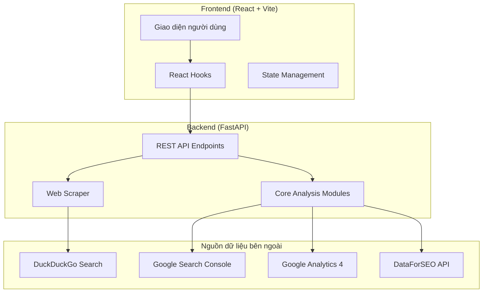

# 📋 Báo Cáo Công Nghệ — AI Marketing Hub v0.9.0

## 1. Tổng quan dự án

**Tên dự án:** AI Marketing Hub  
**Phiên bản:** 0.9.0 (Phase 9)  
**Mô tả:** Nền tảng phân tích SEO & Marketing tự động, tích hợp AI, hỗ trợ kiểm tra chất lượng trang web, theo dõi xếp hạng tìm kiếm thời gian thực, phân tích đối thủ cạnh tranh và lập kế hoạch nội dung.

**Repository:** https://github.com/ROYCE-8425/ai-marketing-hub

---

## 2. Kiến trúc hệ thống



---

## 3. Công nghệ sử dụng

### 3.1 Backend (Python)

| Công nghệ | Phiên bản | Vai trò |
|-----------|----------|---------|
| **Python** | 3.12 | Ngôn ngữ lập trình chính |
| **FastAPI** | ≥0.109.0 | Web framework xây dựng REST API |
| **Uvicorn** | ≥0.27.0 | ASGI web server (hỗ trợ async) |
| **Pydantic** | ≥2.5.0 | Validation dữ liệu & schema |
| **httpx** | ≥0.27.0 | HTTP client bất đồng bộ (scraping) |
| **BeautifulSoup4** | ≥4.12.0 | Phân tích cú pháp HTML |
| **lxml** | ≥5.0.0 | Parser HTML/XML hiệu năng cao |
| **scikit-learn** | ≥1.3.0 | Clustering từ khóa (Machine Learning) |
| **NumPy** | ≥1.24.0 | Thư viện tính toán số |
| **textstat** | ≥0.7.0 | Đánh giá độ dễ đọc (Flesch, Kincaid) |
| **markdown** | ≥3.5 | Chuyển đổi Markdown → HTML |
| **duckduckgo-search** | ≥7.0.0 | Tìm kiếm web thời gian thực |
| **requests** | ≥2.31.0 | HTTP client đồng bộ |

### 3.2 Frontend (TypeScript/React)

| Công nghệ | Phiên bản | Vai trò |
|-----------|----------|---------|
| **React** | 18.x | Thư viện giao diện người dùng |
| **TypeScript** | 5.x | Ngôn ngữ lập trình (type-safe JavaScript) |
| **Vite** | 5.x | Build tool & Dev server |
| **CSS3** | — | Styling (Glassmorphism, Gradient, Animation) |
| **localStorage API** | — | Lưu trữ lịch sử phân tích phía client |

### 3.3 Nguồn dữ liệu & API

| Nguồn | Loại | Chi phí | Dữ liệu cung cấp |
|-------|------|---------|-------------------|
| **Web Scraping** (httpx + BS4) | Trực tiếp | Miễn phí | Phân tích on-page SEO, nội dung |
| **DuckDuckGo Search** | API miễn phí | Miễn phí | Kết quả tìm kiếm thời gian thực |
| **Google Search Console** | Google API | Miễn phí | Ranking, clicks, impressions |
| **Google Analytics 4** | Google API | Miễn phí | Traffic, engagement, bounce rate |
| **DataForSEO** | REST API | ~$50/tháng | Search volume, CPC, keyword difficulty |

### 3.4 DevOps & Công cụ

| Công nghệ | Vai trò |
|-----------|---------|
| **Git** | Quản lý phiên bản mã nguồn |
| **GitHub** | Lưu trữ repository |
| **npm** | Quản lý package JavaScript |
| **pip** | Quản lý package Python |
| **venv** | Môi trường ảo Python |

---

## 4. Danh sách Module Backend

### 4.1 Core Analysis Modules (`backend/core/`)

| Module | Chức năng |
|--------|----------|
| `seo_analyzer.py` | Phân tích SEO on-page (title, meta, heading, keyword) |
| `keyword_analyzer.py` | Phân tích & phân cụm từ khóa (TF-IDF + KMeans) |
| `readability_analyzer.py` | Đánh giá độ dễ đọc nội dung |
| `schema_checker.py` | Kiểm tra Schema/Structured Data |
| `above_fold_analyzer.py` | Phân tích phần trên màn hình |
| `cro_checker.py` | Kiểm tra tối ưu chuyển đổi (CRO) |
| `cta_analyzer.py` | Phân tích nút kêu gọi hành động |
| `trust_signal_checker.py` | Phát hiện tín hiệu uy tín |
| `competitor_gap_analyzer.py` | So sánh khoảng cách với đối thủ |
| `article_planner.py` | Lập kế hoạch bài viết AI |
| `content_scrubber.py` | Tẩy dấu vết AI (zero-width chars) |
| `readability_scorer.py` | Tính điểm Flesch Reading Ease |
| `engagement_analyzer.py` | Phân tích hook, nhịp, CTA |
| `content_length_comparator.py` | So sánh độ dài nội dung đối thủ |
| `google_serp_scraper.py` | Scrape kết quả tìm kiếm (DuckDuckGo) |
| `data_aggregator.py` | Tổng hợp dữ liệu từ nhiều nguồn |
| `google_analytics.py` | Kết nối Google Analytics 4 |
| `google_search_console.py` | Kết nối Google Search Console |
| `dataforseo.py` | Kết nối DataForSEO API |

### 4.2 API Routers (`backend/routers/`)

| Router | Prefix | Chức năng |
|--------|--------|----------|
| `api_seo.py` | `/api/seo` | Kiểm tra SEO toàn diện |
| `api_content.py` | `/api/content` | Phân tích đối thủ, lập kế hoạch nội dung |
| `api_execution.py` | `/api/execution` | Chấm điểm cơ hội, xuất bản WordPress |
| `api_data.py` | `/api/data` | Kết nối GSC, GA4, DataForSEO |
| `api_polish.py` | `/api/content/polish` | Tẩy AI watermark, đánh giá readability |
| `api_serp.py` | `/api/serp` | SERP Live & Deep Analyze |

---

## 5. Danh sách Component Frontend

### 5.1 Components (`frontend/src/components/`)

| Component | Chức năng |
|-----------|----------|
| `DashboardOverview.tsx` | Trang tổng quan: stat cards, lịch sử, quick actions |
| `ScoreRing.tsx` | Biểu đồ vòng tròn điểm số |
| `CroDashboard.tsx` | Dashboard CRO & Trust signals |
| `CompetitorRadar.tsx` | Panel so sánh đối thủ cạnh tranh |
| `ContentPlanner.tsx` | Panel lập kế hoạch nội dung AI |
| `CampaignTracker.tsx` | Panel theo dõi chiến dịch |
| `SerpResultsPanel.tsx` | Bảng kết quả SERP, deep analyze, export CSV |
| `PublishModal.tsx` | Modal xuất bản lên WordPress |

### 5.2 Hooks (`frontend/src/hooks/`)

| Hook | Chức năng |
|------|----------|
| `useSeoAudit.ts` | Gọi API kiểm tra SEO |
| `useOpportunities.ts` | Gọi API chấm điểm cơ hội |
| `useAutoFill.ts` | Tự động điền metrics từ GSC/DataForSEO |
| `useSerpLive.ts` | Gọi API SERP Live & Deep Analyze |

### 5.3 Utilities (`frontend/src/lib/`)

| File | Chức năng |
|------|----------|
| `apiConfig.ts` | Cấu hình base URL cho API |
| `history.ts` | Lưu/đọc lịch sử phân tích (localStorage) + Export CSV |

---

## 6. API Endpoints

| Method | Endpoint | Mô tả |
|--------|---------|-------|
| `GET` | `/health` | Kiểm tra trạng thái server |
| `POST` | `/api/seo/audit` | Kiểm tra SEO toàn diện cho URL |
| `POST` | `/api/content/competitor-gap` | Phân tích khoảng cách đối thủ |
| `POST` | `/api/content/plan` | Tạo dàn ý bài viết AI |
| `POST` | `/api/execution/score-opportunity` | Chấm điểm cơ hội xếp hạng |
| `POST` | `/api/execution/publish-wordpress` | Xuất bản lên WordPress |
| `GET` | `/api/data/status` | Trạng thái kết nối data sources |
| `POST` | `/api/data/gsc-sync` | Đồng bộ dữ liệu Google Search Console |
| `POST` | `/api/data/serp-sync` | Đồng bộ dữ liệu DataForSEO |
| `POST` | `/api/data/bulk-sync` | Đồng bộ tất cả nguồn dữ liệu |
| `POST` | `/api/content/polish` | Tẩy AI watermark + đánh giá readability |
| `POST` | `/api/serp/live` | Tìm kiếm SERP thời gian thực |
| `POST` | `/api/serp/deep-analyze` | Phân tích sâu nội dung đối thủ |

---

## 7. Cấu trúc thư mục

```
ai-marketing-hub/
├── backend/
│   ├── main.py                    # FastAPI application entry
│   ├── requirements.txt           # Python dependencies
│   ├── core/                      # 19 analysis modules
│   │   ├── seo_analyzer.py
│   │   ├── keyword_analyzer.py
│   │   ├── google_serp_scraper.py
│   │   ├── content_scrubber.py
│   │   └── ...
│   └── routers/                   # 6 API routers
│       ├── api_seo.py
│       ├── api_content.py
│       ├── api_serp.py
│       └── ...
├── frontend/
│   ├── package.json
│   ├── vite.config.ts
│   ├── index.html
│   └── src/
│       ├── App.tsx                # Main application (1011 lines)
│       ├── index.css              # Global styles
│       ├── components/            # 8 UI components
│       ├── hooks/                 # 4 custom hooks
│       ├── lib/                   # Utilities (apiConfig, history)
│       └── types/                 # TypeScript type definitions
├── .gitignore
└── README.md
```

---

## 8. Tính năng chính (9 Phase)

| Phase | Tính năng | Trạng thái |
|-------|----------|-----------|
| 1 | Kiểm tra SEO on-page (Title, Meta, Heading, Keyword) | ✅ Hoàn thành |
| 2 | CRO & Trust Signal Analysis | ✅ Hoàn thành |
| 3 | Phân tích đối thủ cạnh tranh (Competitor Gap) | ✅ Hoàn thành |
| 4 | Viết nội dung AI (Content Planner) | ✅ Hoàn thành |
| 5 | Xuất bản WordPress + Chấm điểm cơ hội | ✅ Hoàn thành |
| 6 | Kết nối dữ liệu thực (GSC, GA4, DataForSEO) | ✅ Hoàn thành |
| 7 | Anti-AI Detection & Content Polish | ✅ Hoàn thành |
| 8 | SERP Live — Kết quả tìm kiếm thời gian thực | ✅ Hoàn thành |
| 9 | Dashboard tổng quan, Lịch sử & Export CSV | ✅ Hoàn thành |

---

## 9. Kỹ thuật thiết kế nổi bật

| Kỹ thuật | Mô tả |
|---------|-------|
| **Glassmorphism UI** | Giao diện mờ kính, gradient, micro-animation |
| **Async/Await** | Xử lý bất đồng bộ cho scraping & API calls |
| **asyncio.to_thread** | Chạy code đồng bộ trong thread pool (DuckDuckGo) |
| **Timeout + Fallback** | 10s timeout + mock data khi mạng lỗi |
| **TF-IDF + KMeans** | Phân cụm từ khóa bằng Machine Learning |
| **Flesch Reading Ease** | Đánh giá độ dễ đọc theo tiêu chuẩn quốc tế |
| **Zero-width char detection** | Phát hiện dấu vết AI trong nội dung |
| **localStorage persistence** | Lưu lịch sử phân tích phía client |
| **CSV Export** | Xuất dữ liệu với BOM UTF-8 (hỗ trợ tiếng Việt) |
| **User-Agent rotation** | Xoay vòng User-Agent tránh bị chặn |
| **CORS middleware** | Cho phép Frontend gọi Backend cross-origin |
| **Hot Module Replacement** | Cập nhật code tự động khi phát triển |

---

## 10. Nguồn dữ liệu — Thật vs Mock

### 10.1 Dữ liệu THẬT 100% (hoạt động ngay, không cần API key)

| Chỉ số | Nguồn | Phương pháp |
|--------|-------|-------------|
| Title tag, Meta description | httpx + BS4 | Scrape HTML trực tiếp |
| Cấu trúc Heading (H1–H6) | httpx + BS4 | Phân tích DOM tree |
| Số từ, hình ảnh, liên kết | httpx + BS4 | Đếm phần tử HTML |
| Schema/Structured Data | httpx + BS4 | Phát hiện JSON-LD, Microdata |
| Open Graph, Canonical, Viewport | httpx + BS4 | Đọc thẻ meta |
| Điểm dễ đọc (Flesch) | textstat | Công thức Flesch Reading Ease |
| Above-fold analysis | BS4 + lxml | Phân tích visual layout |
| CTA detection | BS4 | Regex + DOM pattern matching |
| Trust signals | BS4 | Phát hiện logo, badge, review |
| Phát hiện AI watermark | content_scrubber | Tìm zero-width characters |
| Kết quả SERP (Top 10–20) | duckduckgo-search | Search API miễn phí |
| Nội dung đối thủ (word count) | httpx + BS4 | Scrape song song (parallel) |
| Phân cụm từ khóa | scikit-learn | TF-IDF + KMeans clustering |

### 10.2 Dữ liệu MOCK/ƯỚC TÍNH (cần API key để có dữ liệu thật)

| Chỉ số | API cần thiết | Chi phí |
|--------|--------------|---------|
| Search Volume (lượng tìm kiếm) | DataForSEO | ~$50/tháng |
| CPC (chi phí mỗi nhấp) | DataForSEO | ~$50/tháng |
| Keyword Difficulty (độ khó) | DataForSEO | ~$50/tháng |
| Search Intent (ý định tìm kiếm) | DataForSEO | ~$50/tháng |
| Vị trí ranking trên Google | Google Search Console | Miễn phí |
| Clicks (lượt nhấp từ Google) | Google Search Console | Miễn phí |
| Impressions (lượt hiển thị) | Google Search Console | Miễn phí |
| CTR (tỷ lệ nhấp) | Google Search Console | Miễn phí |
| Traffic, Sessions | Google Analytics 4 | Miễn phí |
| Bounce rate, Engagement | Google Analytics 4 | Miễn phí |

---

## 11. Hướng dẫn kết nối Google Search Console

### Điều kiện:
- Có website đã xác minh trên Google Search Console
- Có tài khoản Google Cloud Platform (miễn phí)

### Các bước:

**Bước 1: Tạo Google Cloud Project**
- Truy cập: https://console.cloud.google.com
- Bấm "Select a project" → "New Project"
- Đặt tên: `AI Marketing Hub`

**Bước 2: Bật Search Console API**
- Vào: APIs & Services → Library
- Tìm: "Google Search Console API"
- Bấm: Enable

**Bước 3: Cấu hình OAuth Consent Screen**
- Vào: APIs & Services → OAuth consent screen
- Chọn: External
- Điền tên app: `AI Marketing Hub`
- Thêm scope: `https://www.googleapis.com/auth/webmasters.readonly`
- Thêm test user: email Google của bạn

**Bước 4: Tạo OAuth Client ID**
- Vào: APIs & Services → Credentials
- "Create Credentials" → "OAuth client ID"
- Application type: Web application
- Authorized redirect URIs: `http://localhost:8000/callback`
- Bấm Create → lưu lại `Client ID` và `Client Secret`

**Bước 5: Lấy Refresh Token**
- Mở trình duyệt, dán URL (thay YOUR_CLIENT_ID):
```
https://accounts.google.com/o/oauth2/v2/auth?client_id=YOUR_CLIENT_ID&redirect_uri=http://localhost:8000/callback&response_type=code&scope=https://www.googleapis.com/auth/webmasters.readonly&access_type=offline&prompt=consent
```
- Đăng nhập → cấp quyền → copy authorization code từ URL callback
- Đổi code thành refresh token (xem Bước 6)

**Bước 6: Đổi Authorization Code → Refresh Token**
```bash
curl -X POST https://oauth2.googleapis.com/token \
  -d "code=YOUR_AUTH_CODE" \
  -d "client_id=YOUR_CLIENT_ID" \
  -d "client_secret=YOUR_CLIENT_SECRET" \
  -d "redirect_uri=http://localhost:8000/callback" \
  -d "grant_type=authorization_code"
```
- Response sẽ chứa `refresh_token` → lưu lại

---

## 12. Biến môi trường (Environment Variables)

Tạo file `backend/.env` với nội dung:

```env
# ─── Google Search Console (miễn phí) ──────────────────────
GOOGLE_SEARCH_CONSOLE_CLIENT_ID=xxxxxxxxxxxx.apps.googleusercontent.com
GOOGLE_SEARCH_CONSOLE_CLIENT_SECRET=GOCSPX-xxxxxxxxxxxx
GOOGLE_SEARCH_CONSOLE_REFRESH_TOKEN=1//xxxxxxxxxxxx
GSC_SITE_URL=https://yourwebsite.com

# ─── Google Analytics 4 (miễn phí) ─────────────────────────
GA4_PROPERTY_ID=123456789
GA4_CREDENTIALS_PATH=/path/to/service-account.json

# ─── DataForSEO (trả phí ~$50/tháng) ──────────────────────
DATAFORSEO_LOGIN=your_email@example.com
DATAFORSEO_PASSWORD=your_api_password

# ─── WordPress (tùy chọn) ─────────────────────────────────
WP_URL=https://yoursite.com
WP_USERNAME=admin
WP_APP_PASSWORD=xxxx xxxx xxxx xxxx
```

---

## 13. Yêu cầu hệ thống

| Thành phần | Yêu cầu tối thiểu |
|-----------|-------------------|
| **Hệ điều hành** | Linux (Ubuntu 22.04+), macOS, Windows 10+ |
| **Python** | 3.10 trở lên (khuyến nghị 3.12) |
| **Node.js** | 18.x trở lên (khuyến nghị 20.x) |
| **npm** | 9.x trở lên |
| **RAM** | 4GB tối thiểu |
| **Dung lượng ổ đĩa** | 500MB cho dependencies |
| **Kết nối mạng** | Yêu cầu cho scraping & API calls |

### Lệnh khởi chạy:

```bash
# Backend
cd backend
python3 -m venv venv
source venv/bin/activate
pip install -r requirements.txt
uvicorn main:app --reload --port 8000

# Frontend (terminal mới)
cd frontend
npm install
npm run dev
```

Truy cập: http://localhost:5173
